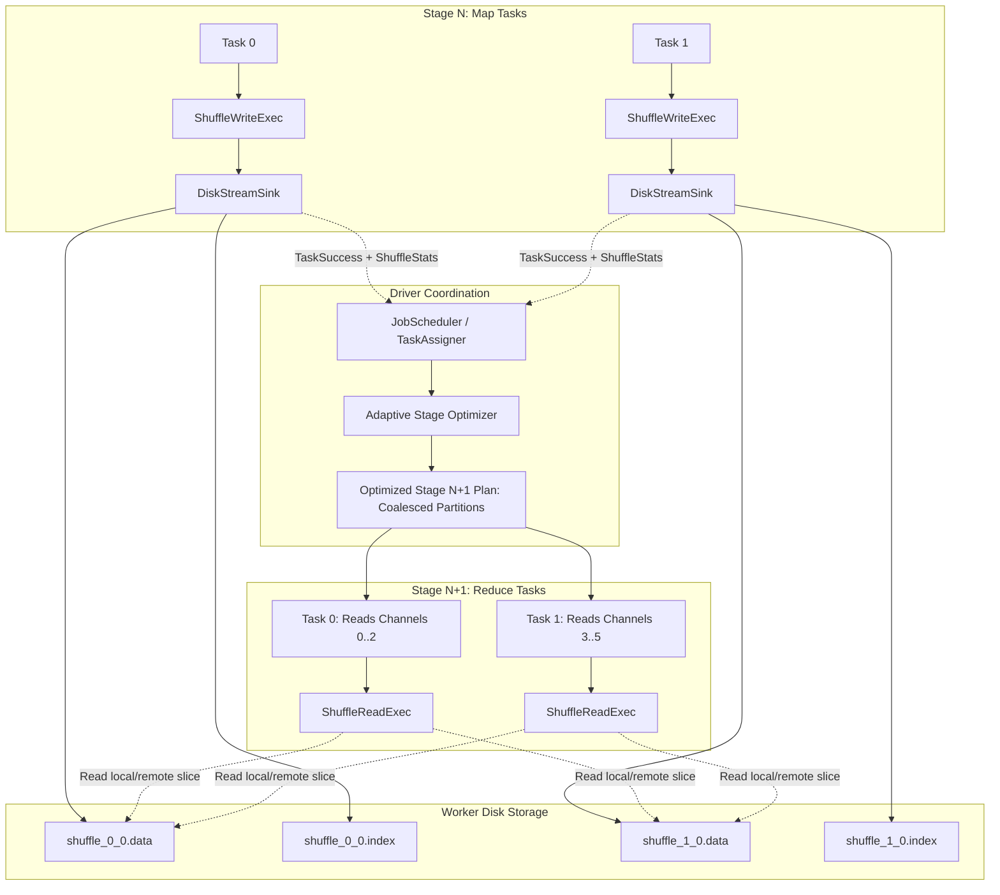

# Adaptive Disk-Based Shuffle Architecture & Design

## 1. Context & Problem Statement

LakeSail's execution engine (`sail-execution`) currently relies on in-memory streams (`LocalStreamStorage::Memory`) using Tokio `mpsc` channels and Arrow Flight for distributing data across task stages.

While in-memory streaming delivers low latency for small or medium datasets, it suffers from several fundamental limitations in distributed data processing at scale:
1. **OOM & Memory Pressure**: If intermediate shuffle data exceeds the worker's physical RAM, or if downstream stages read slower than upstream stages produce, channel buffers and memory overflow queues grow uncontrollably, leading to task failure or worker termination.
2. **Coupled Stage Execution**: In-memory streaming tightly couples the lifetimes of upstream and downstream stages. Upstream workers must hold intermediate batches in memory until downstream stages consume them, preventing resources (memory, CPU, threads) from being reclaimed.
3. **Rigid Partitioning**: Upstream query planning must estimate partition counts ahead of time. In reality, data sizes after filtering or aggregating often differ drastically from estimates, causing either thousands of tiny tasks (high scheduling overhead) or skewed massive partitions (stragglers).

This document proposes a unified **Adaptive Disk-Based Shuffle** subsystem for LakeSail. It combines persistent on-disk shuffle storage (`LocalStreamStorage::Disk`) with runtime partition statistics to support **Adaptive Query Execution (AQE)**.

---

## 2. System Architecture



---

## 3. On-Disk Storage Layout

Instead of generating $M \times R$ individual files (where $M$ is map tasks and $R$ is reduce channels)—which creates massive inode and file descriptor exhaustion—we use **consolidated partition files**:

For each task attempt (`job_id`, `stage`, `partition`, `attempt`), two files are created:
1. **Data File** (`shuffle_<partition>_<attempt>.data`):
   * Contains serialized Arrow `RecordBatch` streams for all $R$ channels written sequentially in `channel_id` order (0 to $R-1$).
   * Encoded using **Arrow IPC Stream format** with optional block compression (LZ4 or ZSTD).
2. **Index File** (`shuffle_<partition>_<attempt>.index`):
   * An array of `u64` values with length `channels + 1`.
   * Entry `i` specifies the absolute byte offset of channel `i` in the `.data` file.
   * Length of channel `i` is `offset[i + 1] - offset[i]`.
   * Enables $O(1)$ random seeking to any channel or contiguous channel range.

```
+-----------------------------------------------------------------------------------------+
| shuffle_p_a.index: [offset_0=0, offset_1, offset_2, ..., offset_R=total_bytes]          |
+-----------------------------------------------------------------------------------------+
| shuffle_p_a.data:  | Channel 0 Batches | Channel 1 Batches | ... | Channel R-1 Batches | |
+-----------------------------------------------------------------------------------------+
```

---

## 4. Component Design in `sail-execution`

### 4.1 Disk Stream Abstraction (`stream_manager/local.rs`)

Implement `LocalStream` for disk storage:

```rust
pub struct DiskStream {
    base_path: PathBuf,
    key: TaskStreamKey,
    schema: SchemaRef,
    channels: usize,
}

pub struct DiskStreamSink {
    data_file: BufWriter<tokio::fs::File>,
    index_file: BufWriter<tokio::fs::File>,
    offsets: Vec<u64>,
    partition_records: Vec<u64>,
    current_channel: usize,
    bytes_written: u64,
}
```

* **Writing**:
  * As batches arrive from `ShuffleWriteExec`, they are serialized using `arrow_ipc::writer::StreamWriter`.
  * In-memory buffering flushes sequentially to disk.
  * Files are initially written with a `.tmp` extension and atomically renamed upon completion.

* **Reading**:
  * **Local Read**: If the downstream consumer resides on the same worker, it opens the `.index` file, reads `[offset[channel], offset[channel + 1]]`, and streams directly from the `.data` file (leveraging `tokio::fs::File` or memory-mapped I/O).
  * **Remote Read**: If the consumer is on another node, `TaskStreamFlightServer` resolves the ticket, slices the requested range from disk, and streams the Arrow batches over Arrow Flight gRPC.

### 4.2 Tracking Partition Statistics

When `DiskStreamSink::close()` completes, it constructs runtime statistics:

```rust
#[derive(Debug, Clone, PartialEq, Eq)]
pub struct TaskShuffleStats {
    pub partition_bytes: Vec<u64>,
    pub partition_records: Vec<u64>,
    pub total_bytes: u64,
}
```

The worker sends `TaskShuffleStats` to the driver inside `TaskStatus::Success`.

---

## 5. Adaptive Query Execution (AQE) Rules

Once all tasks in Stage $N$ complete, the Driver evaluates the stage using the exact shuffle statistics before scheduling Stage $N+1$:

### 5.1 Dynamic Partition Coalescing
* **Target Size**: Configurable via `sail.execution.shuffle.target_partition_size` (default: 64 MB).
* **Algorithm**:
  * The Driver aggregates the bytes for each channel $c \in [0, R)$ across all map tasks:
    $$\text{TotalSize}(c) = \sum_{m=0}^{M-1} \text{TaskStats}_m[\text{bytes}][c]$$
  * Adjacent channels with combined sizes below target partition size are grouped into **Partition Ranges** $[c_{start}, c_{end})$.
  * A single downstream task is assigned to read the range $[c_{start}, c_{end})$.
  * Because channels $c_{start}..c_{end}$ are stored sequentially in upstream `.data` files, reading a range requires only **a single contiguous I/O seek** from `offset[c_start]` to `offset[c_end]`.

### 5.2 Dynamic Skew Partition Splitting
* If a single partition's size exceeds $\text{median} \times \text{skew_factor}$ (e.g. 5x) and exceeds `min_skew_threshold` (e.g. 128 MB):
  * The driver splits the single partition across multiple downstream reader tasks, where each task reads a sub-range of map outputs.

### 5.3 Dynamic Join Optimization
* If the total shuffle output size of one join side is smaller than `sail.execution.shuffle.auto_broadcast_threshold` (e.g., 10 MB), the downstream join is rewritten from `SortMergeJoin` to `BroadcastHashJoin`, bypassing shuffle read for the other side.

---

## 6. Lifecycle & Garbage Collection

1. **Stage Completion Cleanup**: When the Driver verifies that all downstream stages consuming Stage $S$ have finished, it dispatches `CleanStageShuffleFiles { job_id, stage }` RPCs to all workers.
2. **Job Termination Cleanup**: When a job terminates (success or failure), `<shuffle_dir>/<job_id>` is deleted recursively on all nodes.
3. **Speculative Execution / Attempt Isolation**: File names include `attempt_id` (`shuffle_<partition>_<attempt>.data`). Unused attempts are discarded during task cleanup.

---

## 7. Configuration Reference

| Parameter | Default | Description |
| :--- | :--- | :--- |
| `sail.execution.shuffle.storage` | `auto` | `memory`, `disk`, or `auto` (spill to disk when memory threshold is reached). |
| `sail.execution.shuffle.dir` | `/tmp/sail/shuffle` | Root path for shuffle data files (supports comma-separated paths for JBOD). |
| `sail.execution.shuffle.compression` | `lz4` | Compression format for intermediate shuffle data (`none`, `lz4`, `zstd`). |
| `sail.execution.shuffle.adaptive.enabled` | `true` | Enable Adaptive Query Execution on shuffle boundaries. |
| `sail.execution.shuffle.adaptive.target_size` | `67108864` (64MB) | Target byte size for coalesced reduce partitions. |
