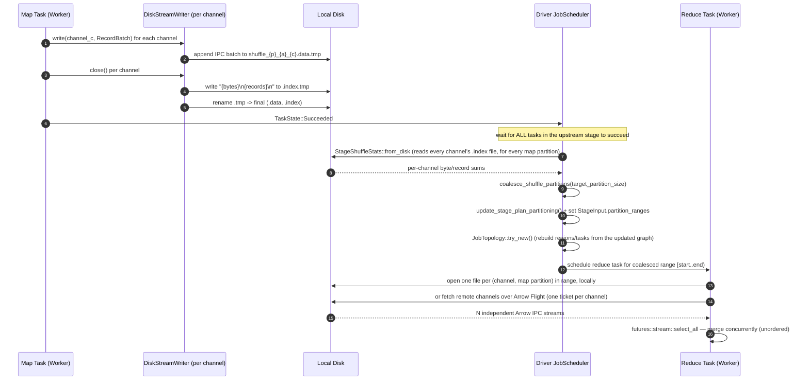

# Adaptive Disk-Based Shuffle Architecture & Design

`sail-execution` normally moves shuffle data between task stages purely in memory (`OutputMode::Pipelined`, Tokio `mpsc` channels), streaming directly from a running upstream task to a running downstream task. This document describes an alternate, disk-backed shuffle path (`OutputMode::Blocking`, `LocalStreamStorage::Disk`) plus a runtime-statistics layer that can adapt downstream partitioning to the volume of data actually produced, instead of the volume planned at compile time. Key pieces, as implemented today:

1. **Persistent on-disk shuffle (`DiskStream`)** — one Arrow IPC file per shuffle channel, with a small text index file and atomic rename for crash-safe writes.
2. **Cheap runtime channel statistics** — `StageShuffleStats::from_disk` derives each channel's byte/record size by reading its two-line `.index` file, without opening the (potentially large) `.data` file.
3. **Dynamic partition coalescing** — `coalesce_shuffle_partitions` merges adjacent small channels into `~target_partition_size` groups, and the scheduler rewrites the downstream stage's plan and task count accordingly.
4. **Skew and broadcast-join *detection*** — `detect_skew_partitions` and `should_broadcast_join` compute real signals from the stats, but today only feed a debug log line; no plan mitigation is wired to them yet (§7.2, §7.3).
5. **Stage lifecycle decoupling (`OutputMode::Blocking`)** — when active, upstream tasks finish writing to disk and exit before the downstream stage is even scheduled, rather than the two overlapping in time.
6. **Test coverage** — 18 unit/integration tests across `adaptive.rs`, `driver/job_scheduler/core.rs`, and `stream_manager/local.rs` (§12).

This document was last checked against the code at commit `7a112171` (`fix(execution): fix adaptive disk shuffle correctness, topology, streaming, and tests`), which substantially reworked the on-disk layout and reader path from the original implementation commits (§3) — a combined multi-channel data file with a binary offset index and a `TaskInputLocator::LocalDisk` variant were both superseded by the simpler per-channel-file layout described here.

---

## 1. Context & Problem Statement

While pure in-memory pipelining delivers near-zero latency for small queries, it has well-known limitations at scale:

1. **Unbounded Memory Pressure & OOMs**
   - Intermediate data lives entirely in process memory (bounded only by the `mpsc` channel capacity and an overflow `VecDeque` per receiver — see `MemoryStreamReplicaSender` in `stream_manager/local.rs`).
   - If a downstream consumer is slower than its upstream producer, the overflow buffer grows unbounded, risking OOM.
2. **Coupled Stage Execution Lifecycles**
   - Because pipelined stages stream directly to each other, upstream and downstream tasks in the same pipeline must be alive concurrently. This couples scheduling and makes it hard to free upstream compute slots early.
3. **Rigid Static Partitioning**
   - The shuffle partition (channel) count is fixed when the physical plan is built, before any data has been produced.
   - Selective filters, aggregations, or skewed keys can make the actual post-shuffle distribution deviate by orders of magnitude from what was planned:
     - **Too many partitions** → scheduling overhead, tiny I/O, poor batch packing.
     - **Too few / skewed partitions** → straggler tasks that process far more data than their peers.

To address these problems, `sail-execution` also implements an **on-disk shuffle mode** plus a runtime statistics/coalescing layer that can adapt downstream partitioning to the actual data volume. The rest of this document describes that subsystem as it exists in the code today, including what is fully wired into the scheduler and what is implemented but not yet activated.

---

## 2. Implementation Status (Read This First)

This is a case where the "adaptive disk shuffle" machinery is **built and unit/integration tested, but not yet the default (or even selectable) execution path in a running driver.** Concretely, in `crates/sail-execution/src/job_graph/mod.rs`:

```rust
#[derive(Debug, Clone, Copy, PartialEq, Eq)]
pub enum OutputMode {
    Pipelined,
    #[cfg_attr(not(test), expect(dead_code))]
    Blocking,
}
```

The `#[expect(dead_code)]` attribute is not incidental — it documents that, outside of `#[cfg(test)]` builds, nothing in production code ever constructs `OutputMode::Blocking`. This is confirmed by `JobSchedulerOptions::from(&DriverOptions)` in `driver/job_scheduler/options.rs`, which hardcodes:

```rust
shuffle_mode: OutputMode::Pipelined, // always, regardless of DriverOptions
```

There is currently no CLI flag, environment variable, or `sail.execution.*` session configuration key that switches a running driver to `Blocking`/disk mode — the `with_shuffle_mode`, `with_adaptive_enabled`, `with_target_partition_size`, `with_skew_factor`, and `with_min_skew_threshold` builder methods on `JobSchedulerOptions` are themselves marked `#[expect(dead_code)]` outside tests, meaning today they are only called from the test suite (see `driver/job_scheduler/core.rs` tests such as `test_adaptive_disk_shuffle_coalescing_workflow`).

What this means in practice:

| Piece | Computed from real data? | Status |
| :--- | :--- | :--- |
| `DiskStream` read/write, atomic rename, index files | — | Implemented, unit-tested, reachable at runtime whenever `LocalStreamStorage::Disk` is requested |
| `StageShuffleStats::from_disk` + `coalesce_shuffle_partitions` | Yes | Implemented, wired into `JobScheduler::schedule_task_regions` behind `adaptive_enabled`, unit- and integration-tested — **acts** on the plan (rewrites partitioning and task count) |
| Plan/topology rewrite for coalesced partitions | — | Implemented and tested |
| Data-skew *detection* (`detect_skew_partitions`) | Yes | Computed on real per-channel byte sums, but the result is only logged (`debug!`) — no mitigation — see §7.2 |
| Data-skew *mitigation* (splitting a skewed channel across multiple reduce tasks) | — | The helper `split_skew_partition` exists but is `#[cfg(test)]`-only; no production code path calls it |
| Broadcast-join *candidate detection* (`should_broadcast_join`) | Yes | Computed on real stats, but only logged — no plan rewrite to `BroadcastHashJoinExec` occurs today — see §7.3 |
| Wiring `OutputMode::Blocking` into a real driver | N/A | **Not done.** `JobSchedulerOptions::from(&DriverOptions)` always produces `Pipelined` |
| `min_partition_size` option | — | Declared in `JobSchedulerOptions` but not read anywhere |

The remainder of this document describes the mechanism as implemented, and calls out these gaps again at the relevant sections so the "what's real" and "what's designed but not yet active" boundary stays clear.

---

## 3. Delivery Timeline & Commit History

```
* 7a112171 - fix(execution): fix adaptive disk shuffle correctness, topology, streaming, and tests
* 4acea9f7 - docs(concepts): add implementation summary for disk-based adaptive shuffle
* 30e0cbb2 - feat(execution): implement disk-based adaptive shuffle coalescing and tests
* 9e0bdb7d - docs: add AGENT.md guidelines for AI agents
* 529baf4b - feat(execution): add LocalDisk locator and index statistics to DiskStream
* 24b5897a - feat(execution): implement DiskStream for local disk-based shuffle
* 238c95dc - docs: add design doc for adaptive disk-based shuffle
```

#### `24b5897a` — implement `DiskStream` for local disk-based shuffle
- Scope: `crates/sail-execution/src/stream_manager/`
- Introduced `DiskStream` and `LocalStreamStorage::Disk`.

#### `529baf4b` — add `LocalDisk` locator and index statistics to `DiskStream`
- Scope: `stream_manager/`, `task/`
- Added an initial index/statistics mechanism. (Superseded by `7a112171`'s simpler per-channel text index — see §5.2.)

#### `9e0bdb7d` — add `AGENT.md` guidelines for AI agents
- Repository-root operational guidelines; unrelated to the shuffle mechanism itself.

#### `30e0cbb2` — implement disk-based adaptive shuffle coalescing and tests
- Scope: `driver/job_scheduler/`
- Added `adaptive.rs` (`StageShuffleStats`, `coalesce_shuffle_partitions`, `detect_skew_partitions`, `should_broadcast_join`, `split_skew_partition`) and wired coalescing into `JobScheduler::schedule_task_regions`.

#### `4acea9f7` — add implementation summary docs
- The original versions of the design and summary docs, since merged into this single document.

#### `7a112171` — fix adaptive disk shuffle correctness, topology, streaming, and tests
- Reworked the on-disk layout to one `.data`/`.index` pair **per channel** (rather than a combined multi-channel file with a binary offset index).
- Simplified the index file to plain two-line text (`bytes\n`, `records\n`).
- Adjusted topology rebuilding and the shuffle-read merge path.
- This is the version described throughout the rest of this document.

---

## 4. End-to-End System Architecture

```mermaid
flowchart TD
    subgraph Upstream Stage [Upstream Stage N: Map Tasks, OutputMode::Blocking]
        M0[Task partition 0] --> SW0[ShuffleWriteExec]
        M1[Task partition 1] --> SW1[ShuffleWriteExec]
        SW0 -->|"one DiskStream per channel"| DSW0["DiskStream writers<br/>shuffle_0_0_0 .. shuffle_0_0_(R-1)"]
        SW1 -->|"one DiskStream per channel"| DSW1["DiskStream writers<br/>shuffle_1_0_0 .. shuffle_1_0_(R-1)"]
    end

    subgraph Worker Disk [Worker Local Filesystem: {shuffle_dir}/{job_id}/{stage}/]
        DSW0 -->|"append framed IPC batches"| F0["shuffle_{p}_{attempt}_{channel}.data (+ .tmp)"]
        DSW0 -->|"on close(): bytes + records"| I0["shuffle_{p}_{attempt}_{channel}.index (+ .tmp)"]
    end

    subgraph Driver [Driver: JobScheduler]
        I0 -.->|"StageShuffleStats::from_disk<br/>(reads all channel .index files)"| SSS["StageShuffleStats<br/>channel_bytes / channel_records"]
        SSS --> CoalesceEngine["coalesce_shuffle_partitions<br/>(target_partition_size)"]
        CoalesceEngine --> Rewrite["update_stage_plan_partitioning<br/>+ StageInput.partition_ranges"]
        Rewrite --> Topo["JobTopology::try_new<br/>(full topology rebuild)"]
    end

    subgraph Downstream Stage [Downstream Stage N+1: Coalesced Reduce Tasks]
        Topo --> R0["Task 0: reads channel range [0..2)"]
        Topo --> R1["Task 1: reads channel range [2..4)"]
        R0 --> SR0[ShuffleReadExec]
        R1 --> SR1[ShuffleReadExec]
        SR0 -->|"open one file (or Flight ticket)<br/>per channel x per map partition"| F0
        SR0 -->|"futures::stream::select_all<br/>(concurrent merge, no ordering)"| Merged0[MergedRecordBatchStream]
    end
```

### Stage decoupling via `OutputMode::Blocking`

- **`OutputMode::Pipelined`**: upstream tasks stream data in-memory directly to downstream consumers as they run; upstream and downstream must overlap in time.
- **`OutputMode::Blocking`**: upstream tasks write their shuffle output completely to disk, close the file (triggering the atomic rename described in §5.3), and exit. The driver does not schedule the downstream stage's task region until *all* tasks in the upstream stage have reached `TaskState::Succeeded` (see `all_upstream_ready` in `optimize_stages_adaptively`, §7). Once that holds, the adaptive-optimization pass runs, and only then is the downstream region scheduled.

---

## 5. On-Disk Storage Layout & Format

Each `(map partition, attempt)` shuffle output is split into **one file pair per output channel**, not one pair covering all channels. This is the actual layout written by `DiskStream::publish`/`close` in `stream_manager/local.rs` and read back by `StreamManager::fetch_local_stream` in `stream_manager/core.rs`:

```
{shuffle_dir}/{job_id}/{stage}/
    ├── shuffle_0_0_0.data      # map partition 0, attempt 0, channel 0
    ├── shuffle_0_0_0.index
    ├── shuffle_0_0_1.data      # map partition 0, attempt 0, channel 1
    ├── shuffle_0_0_1.index
    ├── shuffle_1_0_0.data      # map partition 1, attempt 0, channel 0
    ├── shuffle_1_0_1.data      # map partition 1, attempt 0, channel 1
    └── ...
```

With `M` map partitions and `R` shuffle channels, this is up to `M x R` file pairs per stage attempt (channels with zero rows still get a `.data`/`.index` pair, just an empty one). This is a deliberate simplification compared to a "single combined file with an offset index" design: it keeps the writer and reader code simple (each `DiskStream` instance owns exactly one channel), at the cost of more open file descriptors during a wide shuffle. There is no `M x R`-avoidance trick in the current implementation.

### 5.1 Data file (`.data`)

The `.data` file is a single Arrow IPC stream (`arrow_ipc::writer::StreamWriter`), written batch-by-batch as the upstream task produces output for that channel:

```rust
// stream_manager/local.rs — DiskStreamWriter::write
if self.stream_writer.is_none() {
    // lazily create the IPC StreamWriter from the first batch's schema
    self.stream_writer = Some(StreamWriter::try_new(file, &batch.schema())?);
}
self.stream_writer.write(&batch)?;
```

There is no explicit length-prefix framing beyond what the Arrow IPC stream format itself provides, and no shuffle-level compression codec (LZ4/ZSTD) configuration exists today — batches are written using whatever encoding the `RecordBatch`/IPC writer default to.

### 5.2 Index file (`.index`)

The index file is **plain UTF-8 text with two lines**, not a binary offset array:

```
{total_bytes}\n{total_records}\n
```

It is written once, in `DiskStreamWriter::close`, after the data file has been fully flushed:

```rust
let index_content = format!("{}\n{}\n", total_bytes, self.total_records);
std::fs::write(&self.tmp_index_path, index_content)?;
```

Because each channel already has its own file, there is no need for an offset table or range-seeking: reading a channel just means opening its `.data` file. The index file exists purely so the driver can learn a channel's size (for coalescing and skew detection) by reading a few bytes of text instead of scanning/opening every `.data` file.

### 5.3 Atomic writes & crash consistency

1. The writer creates `{name}.data.tmp` up front and appends framed IPC batches to it as they arrive.
2. On `close()`, the index content is written to `{name}.index.tmp`.
3. Both temporary files are renamed to their final names (`std::fs::rename`, which is atomic on POSIX filesystems):
   - `shuffle_{p}_{attempt}_{c}.data.tmp -> .data`
   - `shuffle_{p}_{attempt}_{c}.index.tmp -> .index`
4. A reader (`StreamManager::fetch_local_stream`) only recognizes a channel as available once the **final** `.data` file exists — see §6.2. A crash mid-write leaves only `.tmp` files behind, which are simply invisible to readers; nothing currently scans for and deletes orphaned `.tmp` files (no background sweeper — see §10).
5. Because the attempt number is part of the filename, retried map tasks write to a fresh set of files (`shuffle_{p}_{attempt+1}_{c}.*`) rather than overwriting the previous attempt's output.

---

## 6. Component Architecture & Data Flow



### 6.1 `LocalStream` abstraction (`stream_manager/local.rs`)

`MemoryStream` and `DiskStream` both implement the same `LocalStream` trait, which is the whole point of the abstraction — the rest of the system does not need to know which storage backend a given stage uses:

```rust
pub trait LocalStream: Send {
    fn publish(&mut self) -> ExecutionResult<Box<dyn TaskStreamSink>>;
    fn subscribe(&mut self) -> ExecutionResult<TaskStreamSource>;
}
```

`DiskStream` itself is much simpler than a combined multi-channel structure — it represents exactly **one channel's** file:

```rust
pub(crate) struct DiskStream {
    file_path: std::path::PathBuf, // the .data path for this one channel
    is_written: bool,
    senders: Vec<mpsc::Sender<TaskStreamResult<RecordBatch>>>,
}
```

The `senders` field lets a `DiskStream` simultaneously (a) persist batches to disk and (b) forward each batch, as it is written, to any consumer that is already waiting in-process for this exact channel (`DiskStreamWriter::write` calls `sender.try_send(batch.clone())` for every registered sender). This gives same-node consumers a chance at low-latency delivery without waiting for the file to be closed, while the on-disk copy remains the durable, replayable source of truth for late or retried consumers.

### 6.2 Local stream lookup/recovery (`stream_manager/core.rs`)

`StreamManager::fetch_local_stream` is the single entry point a worker uses to obtain a channel's data, whether or not it has seen that channel before:

```rust
Entry::Vacant(entry) => {
    let file_path = shuffle_dir
        .join(job_id.to_string())
        .join(stage.to_string())
        .join(format!("shuffle_{partition}_{attempt}_{channel}.data"));
    if file_path.exists() {
        // The producer already finished and renamed the file: read it directly from disk.
        let mut stream = DiskStream::new(file_path);
        let source = stream.subscribe()?;
        entry.insert(LocalStreamState::Created { stream });
        return Ok(source);
    }
    // Not on disk yet: register as a pending subscriber and probe again later.
    let (tx, rx) = mpsc::channel(self.options.task_stream_buffer);
    entry.insert(LocalStreamState::Pending { senders: vec![tx] });
    ctx.send_with_delay(T::Message::probe_pending_local_stream(key.clone()), self.options.task_stream_creation_timeout);
    Ok(Box::pin(ReceiverStream::new(rx)))
}
```

If the file already exists (the common case for `Blocking` mode, since the driver only schedules the downstream region after all upstream tasks succeed), the consumer reads straight from disk with no coordination needed — this is what "zero-driver-intervention recovery" really means here: no driver round-trip, just a filesystem check. If it does not exist yet (e.g. `Pipelined` mode, or a downstream task racing ahead), the manager falls back to the same pending/probe mechanism `MemoryStream` uses.

### 6.3 Cross-node access: Arrow Flight, not a URI ticket

`StreamManager` also exposes `create_remote_stream`/`fetch_remote_stream`, but as of today **both are unimplemented stubs** that return `ExecutionError::InternalError("not implemented: ...")`. Cross-node shuffle reads instead go through a separate, working mechanism: `stream_service` (`stream_service/server.rs`), which implements the Arrow Flight `FlightService::do_get` RPC. The "ticket" is a protobuf message (`TaskStreamTicket`), not a `sail://...` URI string:

```protobuf
message TaskStreamTicket {
  job_id, stage, partition, attempt, channel  // one specific channel
}
```

The server decodes the ticket, resolves it to a `TaskStreamKey`, calls the same `fetch_local_stream`-backed fetcher used for local access, and streams the result back as Arrow Flight `FlightData`. Each ticket names exactly **one channel of one map-task attempt** — a downstream task that reads a coalesced range of channels across multiple map partitions issues one ticket per `(channel, map partition)` pair, not one ranged request.

### 6.4 Merging multiple sources into one partition

`ShuffleReadExec::execute` (`plan/shuffle_read.rs`) resolves every `TaskReadLocation` assigned to its output partition — one per `(channel, map partition)` combination it needs, whether served locally or over Flight — opens them concurrently (`try_join_all`), and merges the resulting streams with `futures::stream::select_all` (`stream/merge.rs`):

```rust
async fn shuffle_read(reader, locations, schema) -> Result<SendableRecordBatchStream> {
    let streams = try_join_all(locations.iter().map(|l| reader.open(l, schema.clone()))).await?;
    Ok(Box::pin(MergedRecordBatchStream::new(schema, streams))) // select_all: concurrent, unordered
}
```

This is an important nuance for the "coalescing" story in §7: coalescing reduces the **number of downstream tasks and how the plan is partitioned**, not the number of I/O operations. A reduce task covering a coalesced range of `k` channels across `M` map partitions still opens/fetches `k x M` independent sources; it just does so from one task instead of `k` separate tasks, and merges them concurrently rather than sequentially.

---

## 7. Adaptive Query Execution (AQE)

Once every task in an upstream `Blocking` stage has succeeded, `JobScheduler::schedule_task_regions` calls `optimize_stages_adaptively` (guarded by `options.adaptive_enabled`) before the downstream region is scheduled.

### 7.1 Dynamic partition coalescing (implemented and active)

For a query like:

```sql
SELECT city, count(*) FROM logs WHERE level = 'ERROR' GROUP BY city
```

a highly selective filter can leave the statically-planned shuffle partitions nearly empty. `optimize_stages_adaptively` reads the real per-channel byte totals and merges adjacent channels into target-sized groups.

**Step 1 — collect stats.** For every shuffle input of stage `s`, sum each channel's bytes across all upstream map partitions and attempts by reading their `.index` files:

```rust
let stats = StageShuffleStats::from_disk(
    &options.shuffle_dir, job_id, u, upstream_partitions, upstream_channels, &upstream_attempts,
);
```

`StageShuffleStats::from_disk` (`adaptive.rs`) opens `shuffle_{p}_{attempt}_{c}.index` for every `(p, c)` pair, parses the two text lines, and accumulates into `channel_bytes: Vec<u64>` / `channel_records: Vec<usize>`. Missing/unreadable index files are skipped with a `debug!` log, not an error — a partially-written stage simply reports smaller totals rather than failing.

**Step 2 — coalesce.** `coalesce_shuffle_partitions` does a single linear pass, greedily grouping adjacent channels until adding the next one would exceed `target_partition_size` (default 64 MiB, `JobSchedulerOptions::target_partition_size`):

```rust
pub fn coalesce_shuffle_partitions(channel_bytes: &[u64], target_partition_size: u64) -> Vec<Range<usize>> {
    let mut ranges = Vec::new();
    let (mut start, mut current_size) = (0, 0u64);
    for (i, &size) in channel_bytes.iter().enumerate() {
        if current_size > 0 && current_size + size > target_partition_size {
            ranges.push(start..i);
            start = i;
            current_size = size;
        } else {
            current_size += size;
        }
    }
    if start < channel_bytes.len() {
        ranges.push(start..channel_bytes.len());
    }
    ranges
}
```

Properties, directly from the unit tests in `adaptive.rs`:
- `target_partition_size == 0` degenerates to one range per channel (no coalescing) — `test_coalesce_target_zero`.
- A single oversized channel is never split by this function — it becomes its own range and is simply larger than the target (`test_coalesce_skewed_partition`: `[5, 5, 200, 10, 10]` at target 50 → `[0..2, 2..3, 3..5]`). Coalescing only ever *merges* adjacent small channels; it never splits a large one. Splitting is a separate, currently-inactive mechanism (§7.2).
- Ranges are contiguous and exhaustive: `union(ranges) == 0..C` with no overlap.

**Step 3 — apply.** If the number of resulting ranges is smaller than the original channel count, the driver:
1. Stores the ranges on `StageInput.partition_ranges` for every shuffle input of stage `s`.
2. Calls `update_stage_plan_partitioning(plan, ranges.len())`, which walks the stage's `ExecutionPlan` tree and rewrites the partition count on `StageInputExec` and `RepartitionExec` (`RoundRobinBatch`/`Hash`/`UnknownPartitioning`) nodes to match.
3. Replaces `job.stages[s].tasks` with `ranges.len()` fresh (unstarted) task descriptors.
4. After all stages in the loop have been considered, if anything changed, rebuilds the whole `JobTopology` via `JobTopology::try_new(&job.graph)` (see §8) and recomputes region states.

`get_task_input` then uses `StageInput.partition_ranges`, when present, to translate "reduce task `p`" into "read every channel in `ranges[p]`, across all upstream map partitions" (`driver/job_scheduler/core.rs`, `InputMode::Shuffle` branch).

### 7.2 Data-skew detection (implemented) — mitigation (not wired)

`StageShuffleStats::detect_skew_partitions(skew_factor, min_skew_threshold)` flags channel `c` as skewed when both hold:

```
size[c] >= min_skew_threshold          // default 128 MiB
size[c] >  median(non-zero sizes) * skew_factor   // default factor 5.0
```

This runs on real data inside `optimize_stages_adaptively`:

```rust
let skewed = stats.detect_skew_partitions(options.skew_factor, options.min_skew_threshold);
if !skewed.is_empty() {
    debug!("job {job_id} stage {s} upstream stage {u} detected skewed channels: {skewed:?}");
}
```

That `debug!` call is the entire effect of skew detection today — the detected channel indices are not fed back into `coalesce_shuffle_partitions`, into `partition_ranges`, or into any plan rewrite. A helper that *would* support splitting a skewed channel's reads across `K` reduce tasks already exists:

```rust
#[cfg(test)]
pub fn split_skew_partition(num_map_partitions: usize, num_splits: usize) -> Vec<Range<usize>> {
    // divides the *map-partition* axis into K contiguous chunks,
    // so K reduce tasks can each read a slice of map outputs for the same skewed channel
    ...
}
```

but it is compiled only under `#[cfg(test)]`, so no production code path calls it. In other words: today, a single very large channel becomes its own (unsplit) partition, read entirely by one reduce task — exactly the straggler scenario this feature is meant to solve — with only a log line to show it was noticed.

### 7.3 Broadcast-join candidate detection (implemented) — no plan rewrite (not wired)

`StageShuffleStats::should_broadcast_join(auto_broadcast_threshold)` returns `total_bytes > 0 && total_bytes <= auto_broadcast_threshold`. It is called with a **hardcoded** threshold, not a configurable option:

```rust
if stats.should_broadcast_join(10 * 1024 * 1024) { // literal 10MB, not exposed via JobSchedulerOptions
    debug!("job {job_id} stage {s} upstream stage {u} candidate for broadcast join (total: {} bytes)", stats.total_bytes);
}
```

As with skew detection, this is currently detect-and-log only: there is no code path that rewrites a downstream `ShuffleHashJoin`/`SortMergeJoin` into a broadcast join based on this signal.

---

## 8. Topology Rebuild on Coalescing

There is no targeted "resize region N to M tasks" API. Instead, whenever `optimize_stages_adaptively` changes any stage's task count, the driver throws away and rebuilds the *entire* `JobTopology` from the (now-updated) `JobGraph`:

```rust
if topology_changed {
    if let Ok(new_topology) = JobTopology::try_new(&job.graph) {
        job.topology = new_topology;
        job.regions.resize(job.topology.regions.len(), TaskRegionDescriptor { state: TaskRegionState::Running });
        Self::update_task_regions(job, options); // recomputes each region's Succeeded/Failed/Running state
    }
}
```

`JobTopology::try_new` (`driver/job_scheduler/topology.rs`) groups stages into **task regions** by finding connected components of stages joined by `OutputMode::Pipelined` inputs, then, for a component where every internal input is `InputMode::Forward` (i.e. partition `p` of one stage always feeds partition `p` of the next), it "slices" the component by partition index into one region per partition. Regions from different, non-pipelined components (e.g. across a `Blocking` shuffle boundary) are scheduled independently, with dependencies computed from cross-region inputs. `update_stage_plan_partitioning` (which physically rewrites `StageInputExec`/`RepartitionExec` partition counts inside a stage's `ExecutionPlan`) runs *before* this rebuild, so the rebuilt topology already reflects the new, coalesced partition count.

---

## 9. Worked Example: End-to-End Walkthrough

Query: `SELECT department, count(*) FROM employees GROUP BY department;`, with 4 map partitions, 4 shuffle channels, `target_partition_size = 400` bytes, and each map task emitting 50 bytes/channel (200 bytes/channel summed across all 4 map tasks).

```
T0  JobScheduler  schedule_task_regions(): Stage 0 (map, OutputMode::Blocking) region scheduled.
T1  Worker Tasks  Tasks 0..3 each write 4 per-channel DiskStreams:
                  shuffle_{p}_0_{c}.data.tmp + .index.tmp for c in 0..4, p in 0..4
                  on close(): index content is "50\n<rows>\n"; files renamed to final names.
T2  Worker Tasks  All Stage 0 tasks reach TaskState::Succeeded.
T3  JobScheduler  optimize_stages_adaptively(): all_upstream_ready == true for Stage 1's shuffle input.
T4  JobScheduler  StageShuffleStats::from_disk() sums each channel across all 4 map partitions:
                  channel 0..3 each = 200 bytes; total = 800 bytes.
T5  JobScheduler  coalesce_shuffle_partitions([200,200,200,200], target=400):
                  channel 0 (200) + channel 1 (200) = 400 -> range 0..2
                  channel 2 (200) + channel 3 (200) = 400 -> range 2..4
                  2 ranges, down from 4 channels.
T6  JobScheduler  StageInput.partition_ranges = Some([0..2, 2..4]) on Stage 1's shuffle input.
                  update_stage_plan_partitioning(plan, 2): RepartitionExec/StageInputExec -> 2 partitions.
                  Stage 1 tasks reset to 2 fresh task descriptors.
                  JobTopology::try_new(): topology rebuilt; Stage 1's region now has 2 tasks.
T7  JobScheduler  Reduce tasks 0 and 1 scheduled.
                  get_task_input(task 0) -> keys for (channel 0, p 0..4) + (channel 1, p 0..4) = 8 keys.
                  get_task_input(task 1) -> keys for (channel 2, p 0..4) + (channel 3, p 0..4) = 8 keys.
T8  Worker Tasks  ShuffleReadExec opens all 8 sources per task and merges them via
                  futures::stream::select_all (concurrent, no ordering guarantee).
T9  JobScheduler  Once Stage 1's consumers succeed, CleanUpJob{stage: Some(0)} removes Stage 0's directory;
                  job completion removes the whole job directory.
```

---

## 10. Fault Tolerance & Lifecycle Management

What is implemented and verifiable in code:

- **Retry isolation**: task attempt number is part of every shuffle filename (`shuffle_{p}_{attempt}_{c}.*`), so a retried map task never overwrites or corrupts a previous attempt's files; the driver simply reads whichever attempt is `Self::get_latest_task_attempt(job, stage, partition)`.
- **Explicit cleanup, not a background sweeper**: `StreamManager::remove_local_streams(job_id, stage)` recursively removes a stage's shuffle directory, and passing `stage: None` removes the whole job's directory. These are invoked via `JobAction::CleanUpJob` once all consumers of a stage have succeeded, or once the job terminates. There is **no** background TTL-based scavenger thread in the codebase today — a driver crash that skips the cleanup action leaves shuffle directories on disk until something else removes them.
- **Orphaned `.tmp` files**: if a task dies mid-write, its `.data.tmp`/`.index.tmp` files are simply never renamed and are invisible to readers (§5.3), but nothing currently scans for and deletes them either.

What is *not* currently implemented, despite being a natural extension of this design:
- Automatic detection of "downstream task can't find upstream map output" (e.g. because the node holding it crashed and lost local disk) followed by rescheduling the missing map task. No such `NotFound`-triggers-rollback logic exists in `driver/job_scheduler` today; recovering from a lost worker's local shuffle files currently requires resubmitting the job.

---

## 11. Configuration Reference

These are **Rust struct fields with builder methods**, not `sail.execution.*` SQL/session configuration keys — there is currently no session-config or CLI surface for any of them, and (per §2) the driver never constructs `OutputMode::Blocking` in the first place.

`JobSchedulerOptions` (`driver/job_scheduler/options.rs`):

| Field | Type | Default | Notes |
| :--- | :--- | :--- | :--- |
| `shuffle_mode` | `OutputMode` | `Pipelined` | `Blocking` is reachable only via `.with_shuffle_mode(...)`, currently called only in tests. |
| `shuffle_dir` | `PathBuf` | `{tmp}/sail/shuffle` | Base directory for `.data`/`.index` files. |
| `adaptive_enabled` | `bool` | `true` | Gates the entire `optimize_stages_adaptively` pass (coalescing + detection). Irrelevant while `shuffle_mode` is never `Blocking` in production. |
| `target_partition_size` | `u64` | `67108864` (64 MiB) | Passed to `coalesce_shuffle_partitions`. |
| `min_partition_size` | `u64` | `1048576` (1 MiB) | Declared but **not read anywhere** in the current code. |
| `skew_factor` | `f64` | `5.0` | Used by `detect_skew_partitions`; detection result is log-only (§7.2). |
| `min_skew_threshold` | `u64` | `134217728` (128 MiB) | Same caveat. |

`StreamManagerOptions` (`stream_manager/options.rs`):

| Field | Type | Default | Notes |
| :--- | :--- | :--- | :--- |
| `task_stream_buffer` | `usize` | `16` | `mpsc` channel capacity for pending/in-memory stream subscribers. |
| `task_stream_creation_timeout` | `Duration` | `60s` | How long a pending local-stream subscription waits before `fail_local_stream_if_pending` fails it. |
| `shuffle_dir` | `PathBuf` | `{tmp}/sail/shuffle` | Independently defaulted here; must match `JobSchedulerOptions::shuffle_dir` for a real deployment (both currently default to the same temp path, but nothing enforces they stay in sync if overridden). |

The broadcast-join byte threshold (10 MiB) is a literal constant inside `optimize_stages_adaptively`, not a field on any options struct.

---

## 12. Test Coverage

18 tests directly exercise this subsystem (function names are exact, from the current source — this list intentionally excludes unrelated tests that happen to live in the same crate):

**`driver/job_scheduler/adaptive.rs`**
- `test_coalesce_empty`, `test_coalesce_target_zero`, `test_coalesce_all_small_partitions`, `test_coalesce_balanced_partitions`, `test_coalesce_skewed_partition` — `coalesce_shuffle_partitions` edge cases and grouping behavior.
- `test_from_disk_stats` — `StageShuffleStats::from_disk` correctly sums bytes/records across map partitions from real text index files written to a temp dir.
- `test_detect_skew_partitions` — median/threshold skew flagging.
- `test_split_skew_partition` — map-partition range splitting (exercises the test-only helper described in §7.2).
- `test_should_broadcast_join` — byte-threshold check.

**`driver/job_scheduler/core.rs`**
- `test_adaptive_disk_shuffle_coalescing_workflow` — end-to-end: builds a 2-stage plan with `OutputMode::Blocking`, writes real index files simulating 4 small map outputs, and verifies the scheduler coalesces Stage 1 from 4 to 2 partitions.
- `test_adaptive_disabled_preserves_partitions` — same setup with `adaptive_enabled = false`; confirms partitioning is left untouched.
- `test_get_task_input_with_coalesced_ranges` — with `partition_ranges = Some([0..2, 2..4])` set directly, confirms `get_task_input` for partition 0 returns exactly the channel-0 and channel-1 keys.
- `test_disk_shuffle_stage_and_job_cleanup` — confirms `clean_up_stage`/job cleanup actually removes the shuffle directories from disk.
- `test_adaptive_multi_input_coalescing` — a stage with two shuffle inputs (e.g. both sides of a join) gets consistent coalesced ranges.
- `test_task_failure_isolation_in_coalesced_stage` — a failed task within a coalesced region doesn't corrupt sibling tasks' state.

**`stream_manager/local.rs`**
- `test_disk_stream_round_trip` — write then read back a batch through `DiskStream`, checking both the data and the parsed index stats.
- `test_disk_stream_multi_batch_and_empty_batch` — multiple batches including a zero-row batch are all preserved and read back in order for a single channel.
- `test_disk_stream_with_pending_senders` — a subscriber registered before the writer closes gets the batch pushed to it live, *and* a later subscriber can still read the same data back from disk.
- `test_disk_stream_empty_file` — a channel with no batches at all still produces a valid (empty) `.data`/`.index` pair and an empty read stream.

---

## 13. What It Would Take to Turn This On

Since the mechanism itself is implemented and tested, activating it for real workloads is primarily a wiring/config problem, not a missing-feature problem:

1. Remove the hardcoded `shuffle_mode: OutputMode::Pipelined` in `JobSchedulerOptions::from(&DriverOptions)` and thread a real choice through from driver configuration.
2. Remove the corresponding `#[expect(dead_code)]` gates on `OutputMode::Blocking` and the `JobSchedulerOptions` builder methods once they have a production caller.
3. Decide whether skew mitigation (§7.2) and broadcast-join conversion (§7.3) should ship as part of the same change, or land as explicit follow-ups given they currently only log; `split_skew_partition` would need to move out of `#[cfg(test)]` and be connected to `partition_ranges`/task scheduling for the skewed channel.
4. Add a disk-space reclamation story beyond "delete on successful stage/job completion" (§10) before relying on this in long-running or crash-prone environments.
