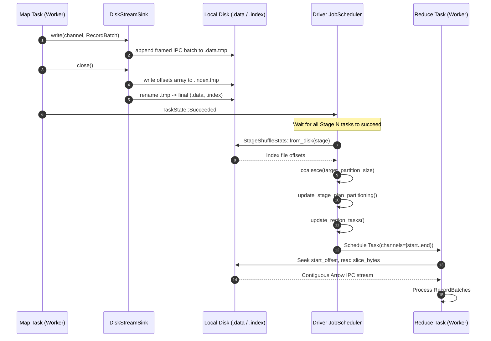

# Adaptive Disk-Based Shuffle Architecture & Design

## 1. Context & Problem Statement

LakeSail's execution engine (`sail-execution`) originally relied on transient in-memory streams (`LocalStreamStorage::Memory`) backed by Tokio unbounded/bounded `mpsc` channels and Arrow Flight for distributing record batches across task stages.

While pure in-memory streaming delivers near-zero latency for micro-benchmarks and small ad-hoc queries, it presents critical limitations in distributed analytical data processing at scale:

1. **Unbounded Memory Pressure & OOMs**:
   - Intermediate shuffle data must reside in process memory.
   - If downstream stages read slower than upstream stages produce (producer-consumer rate disparity), memory buffers balloon, forcing either task failure or out-of-memory (OOM) worker process kills.
   - Memory cannot be spilled or reclaimed until the consumer finishes reading.
2. **Coupled Stage Execution Lifecycles**:
   - Upstream tasks must remain alive and hold channel buffers open until all downstream consumers connect and finish consuming the stream.
   - In a complex multi-stage DAG, upstream workers cannot be repurposed for later stages, creating severe scheduling deadlocks and resource starvation.
3. **Rigid Static Partitioning**:
   - Partition counts in distributed engines must be determined before query execution (e.g., DataFusion physical plan partitioning or Spark's `spark.sql.shuffle.partitions = 200`).
   - Highly selective filters, aggregations, or skew can cause post-shuffle partition sizes to deviate by orders of magnitude from initial estimates:
     - **Too many partitions**: Leads to scheduling storms, excessive task coordination overhead, tiny I/O buffers, and inefficient record batch packing.
     - **Too few partitions / skewed partitions**: Leads to straggler tasks, where a single partition processes gigabytes while others process kilobytes.

To resolve these fundamental architectural bottlenecks, this document specifies a unified **Adaptive Disk-Based Shuffle** subsystem for LakeSail. It combines persistent on-disk shuffle streams (`LocalStreamStorage::Disk`) with runtime statistics aggregation to enable **Adaptive Query Execution (AQE)**.

---

## 2. End-to-End System Architecture

```mermaid
flowchart TD
    subgraph Upstream Stage [Upstream Stage N: Map Tasks]
        M0[Task 0: Partition 0] --> SW0[ShuffleWriteExec]
        M1[Task 1: Partition 1] --> SW1[ShuffleWriteExec]
        SW0 --> DSW0["DiskStreamSink<br/>(LocalStreamStorage::Disk)"]
        SW1 --> DSW1["DiskStreamSink<br/>(LocalStreamStorage::Disk)"]
    end

    subgraph Node Local Filesystem [Worker Disk Storage: JBOD / NVMe]
        DSW0 -->|Buffered Sequential Append| F0_data["shuffle_N_0_0.data"]
        DSW0 -->|Offset Tracking| F0_idx["shuffle_N_0_0.index"]
        DSW1 -->|Buffered Sequential Append| F1_data["shuffle_N_1_0.data"]
        DSW1 -->|Offset Tracking| F1_idx["shuffle_N_1_0.index"]
    end

    subgraph Driver JobScheduler [Driver: JobScheduler & Topology]
        F0_idx -.->|StageShuffleStats::from_disk| SSS["Runtime StageShuffleStats"]
        F1_idx -.->|StageShuffleStats::from_disk| SSS
        SSS --> CoalesceEngine["AQE Partition Coalescer<br/>(Target Size: 64MB)"]
        CoalesceEngine --> PlanRewriter["update_stage_plan_partitioning<br/>(Rewrites Downstream Plan)"]
        PlanRewriter --> TopoUpdater["JobTopology::update_region_tasks<br/>(Resizes Region Tasks)"]
    end

    subgraph Downstream Stage [Downstream Stage N+1: Coalesced Reduce Tasks]
        TopoUpdater --> R0["Task 0: Reads Channels [0..2)"]
        TopoUpdater --> R1["Task 1: Reads Channels [2..4)"]
        R0 --> SR0[ShuffleReadExec / StageInput]
        R1 --> SR1[ShuffleReadExec / StageInput]
        SR0 -->|Slice Seek: offset[0]..offset[2]| F0_data
        SR0 -->|Slice Seek: offset[0]..offset[2]| F1_data
        SR1 -->|Slice Seek: offset[2]..offset[4]| F0_data
        SR1 -->|Slice Seek: offset[2]..offset[4]| F1_data
    end
```

### Stage Decoupling via `OutputMode::Blocking`
The system introduces distinct stage execution modes:
- **`OutputMode::Pipelined`**: Upstream tasks stream data in-memory directly to downstream consumers in lockstep.
- **`OutputMode::Blocking`**: Upstream tasks write their shuffle partitions completely to persistent storage on disk and immediately terminate, freeing their worker threads, memory, and CPU slots. Only when all upstream tasks in the stage succeed does the driver evaluate stage statistics and trigger downstream task scheduling.

---

## 3. On-Disk Storage Layout & Binary Format Specification

Rather than emitting $M \times R$ individual files (where $M$ is map tasks and $R$ is reduce channels)—an anti-pattern that rapidly exhausts filesystem inodes and file descriptors—LakeSail consolidates shuffle outputs into **two files per map task attempt**:

```
{shuffle_dir}/{job_id}/{stage_id}/
    ├── shuffle_0_0.data
    ├── shuffle_0_0.index
    ├── shuffle_1_0.data
    └── shuffle_1_0.index
```

### 3.1 Data File Binary Layout (`.data`)
The `.data` file contains serialized Arrow record batches organized sequentially by channel ID from `0` to `R - 1`.

```
+---------------------------------------------------------------------------------------------------+
| Channel 0: [Len: 8B][IPC Batch 0][Len: 8B][IPC Batch 1]...                                        |
+---------------------------------------------------------------------------------------------------+
| Channel 1: [Len: 8B][IPC Batch 0]...                                                              |
+---------------------------------------------------------------------------------------------------+
| ...                                                                                               |
+---------------------------------------------------------------------------------------------------+
| Channel R-1: [Len: 8B][IPC Batch 0][Len: 8B][IPC Batch 1]...                                      |
+---------------------------------------------------------------------------------------------------+
```

- **Record Framing**: Each serialized record batch is prefixed with an 8-byte little-endian unsigned integer (`u64`) indicating the exact byte length of the following payload.
- **Payload Format**: Standard Arrow IPC stream message (encapsulating schema, dictionary batches, and record batches).
- **Compression**: Configurable per-batch block compression (LZ4_FRAME, ZSTD, or uncompressed).
- **Zero Channels**: Channels with 0 emitted records occupy 0 bytes in `.data`.

### 3.2 Index File Binary Layout (`.index`)
The `.index` file stores a contiguous sequence of little-endian `u64` absolute byte offsets into the `.data` file:

```
+----------------+----------------+----------------+-----+----------------+--------------------+
| Offset 0 (0B)  | Offset 1 (u64) | Offset 2 (u64) | ... | Offset R (u64) | Total Length (u64) |
+----------------+----------------+----------------+-----+----------------+--------------------+
0                8                16                     8*(R-1)          8*R                  8*(R+1)
```

- **Array Length**: Exactly $R + 1$ integers of 8 bytes each, where $R$ is the number of target shuffle channels.
- **Invariants**:
  - `offset[0] == 0`
  - For any channel $c \in [0, R)$: `offset[c] <= offset[c + 1]`
  - Byte size of channel $c$: $\text{Size}(c) = \text{offset}[c + 1] - \text{offset}[c]$
  - Total data file size: $\text{FileLength} = \text{offset}[R]$
- **$O(1)$ Range Seeking**: A downstream task coalescing a range of channels $[c_{start}, c_{end})$ performs:
  1. `start_seek = offset[c_start]`
  2. `end_seek = offset[c_end]`
  3. `slice_bytes = end_seek - start_seek`
  This enables **a single contiguous sequential I/O read** to fetch multiple coalesced channels from a map task.

### 3.3 Atomic Writes & Crash Consistency
1. Writers append output to temporary files: `shuffle_{partition}_{attempt}.data.tmp`.
2. When the task execution pipeline completes, the index file is constructed from in-memory channel offsets and written to `shuffle_{partition}_{attempt}.index.tmp`.
3. Both files are fsynced and renamed via atomic `std::fs::rename` (or POSIX `rename(2)`):
   - `.data.tmp` $\to$ `.data`
   - `.index.tmp` $\to$ `.index`
4. If a task fails or the host crashes mid-execution, any dangling `.tmp` files are ignored and cleaned up by task retry mechanisms.

---

## 4. Component Architecture & Data Flow



### 4.1 Disk Stream Abstraction (`stream_manager/local.rs`)
The `DiskStream` struct acts as a bidirectional channel endpoint:
```rust
pub struct DiskStream {
    channel_offsets: Arc<RwLock<Vec<u64>>>,
    base_dir: PathBuf,
    key: TaskStreamKey,
    schema: SchemaRef,
    num_channels: usize,
}
```
- **Local Stream Consumer**: If the consumer task runs on the same worker node as the producer task, it avoids network round-trips entirely. It opens the local file descriptor, seeks to `offset[start]`, and streams batches directly.
- **Remote Stream Consumer**: If the consumer task runs on a different node, the worker's `FlightService` accepts a `Ticket` formatted as:
  ```
  sail://shuffle/{job_id}/{stage}/{partition}/{channel_start}-{channel_end}
  ```
  The flight server resolves the ticket, slices the byte range from disk, and writes Arrow IPC messages across the gRPC network channel.

### 4.2 Stream Manager Local Recovery (`stream_manager/core.rs`)
In distributed restarts or decoupled execution, a downstream task might request a stream key that is no longer held in `StreamManager` memory.
`fetch_local_stream` inspects the filesystem:
```rust
if let Some(shuffle_dir) = &self.options.shuffle_dir {
    let index_file = shuffle_dir.join(...);
    let data_file = shuffle_dir.join(...);
    if index_file.exists() && data_file.exists() {
        let stream = DiskStream::try_open(...)?;
        return Ok(stream.subscribe(channel));
    }
}
```
This enables zero-driver-intervention local stream recovery.

---

## 5. Adaptive Query Execution (AQE) Specifications

Once all tasks in upstream Stage $N$ succeed, the driver executes the adaptive optimization phase before launching downstream Stage $N+1$.

### 5.1 Dynamic Partition Coalescing
Query optimizers typically cannot accurately predict the cardinality of operations like:
```sql
SELECT city, count(*) FROM logs WHERE level = 'ERROR' GROUP BY city
```
Filtering out 99.9% of rows leaves the default 200 shuffle partitions nearly empty. Coalescing dynamically groups adjacent channels to ensure each downstream task processes approximately `target_partition_size` bytes.

#### Formal Algorithm
Given:
- Number of channels: $C$
- Target partition size in bytes: $T$ (default: 64 MiB)
- Stage shuffle channel byte sums across all map tasks $M$:
  $$S[c] = \sum_{m=0}^{M-1} \text{TaskStats}_{m, c} \quad \text{for } c \in [0, C)$$

```rust
pub fn coalesce(channel_bytes: &[u64], target_partition_size: u64) -> Vec<Range<usize>> {
    let mut ranges = Vec::new();
    let mut current_start = 0;
    let mut current_size = 0u64;

    for (c, &size) in channel_bytes.iter().enumerate() {
        if current_size + size > target_partition_size && current_size > 0 {
            ranges.push(current_start..c);
            current_start = c;
            current_size = size;
        } else {
            current_size += size;
        }
    }

    if current_start < channel_bytes.len() {
        ranges.push(current_start..channel_bytes.len());
    }

    ranges
}
```

#### Invariants & Guarantees
1. **Contiguity**: Every output partition corresponds to a contiguous sub-slice $[c_{start}, c_{end})$.
2. **Completeness**: $\bigcup_{p} \text{range}_p = [0, C)$ and $\text{range}_i \cap \text{range}_j = \emptyset$ for $i \neq j$.
3. **Deterministic Assignment**: Downstream task $p$ reads range $p$.

---

### 5.2 Dynamic Data Skew Detection & Mitigation
Data skew occurs when one or a few partition keys contain disproportionately large amounts of data (e.g., `NULL` values or heavy hitter keys).

#### Detection Criteria
A channel $c$ is marked as **skewed** if:
1. $S[c] \ge \text{min\_skew\_threshold}$ (e.g., 128 MiB), **AND**
2. $S[c] > \text{median}(\{S[i] \mid S[i] > 0\}) \times \text{skew\_factor}$ (e.g., $\text{factor} = 5.0$).

#### Mitigation via Skew Partition Splitting
Instead of having a single reduce task read all map outputs for channel $c$, the driver splits the $M$ upstream map partitions into $K$ slices:
$$K = \left\lceil \frac{S[c]}{T} \right\rceil$$
Downstream tasks are spawned where:
- Task $1$ reads channel $c$ from map tasks $0 .. \lfloor M/K \rfloor$
- Task $2$ reads channel $c$ from map tasks $\lfloor M/K \rfloor .. \lfloor 2M/K \rfloor$
- Task $K$ reads channel $c$ from map tasks $\lfloor (K-1)M/K \rfloor .. M$

This parallelizes skewed channel processing across $K$ workers without modifying upstream data files.

---

### 5.3 Dynamic Broadcast Join Conversion
During static query compilation, joins with unknown cardinalities default to `SortMergeJoin` or `ShuffleHashJoin`. If the upstream stage shuffle output $S_{total} = \sum S[c]$ is smaller than `auto_broadcast_threshold` (e.g., 10 MiB):
1. The driver halts downstream shuffle scheduling.
2. The downstream stage physical plan is rewritten from `ShuffleHashJoin` to `BroadcastHashJoinExec`.
3. The small side is broadcast to all workers executing the large side, eliminating the shuffle barrier for the large relation.

---

## 6. Physical Plan Rewriting & Scheduler Topology

### 6.1 Plan Partitioning Rewriting (`update_stage_plan_partitioning`)
To resize a stage from $C$ partitions to $P$ coalesced partitions, the driver traverses the DataFusion `ExecutionPlan` tree:

```rust
fn update_stage_plan_partitioning(
    plan: Arc<dyn ExecutionPlan>,
    new_partition_count: usize,
) -> ExecutionResult<Arc<dyn ExecutionPlan>> {
    // 1. If plan is RepartitionExec, adjust Partitioning count
    // 2. Recursively rewrite children
    // 3. Recreate parent node using with_new_children
}
```

Supported plan node rewrites:
- `Partitioning::RoundRobinBatch(n) -> Partitioning::RoundRobinBatch(new_n)`
- `Partitioning::Hash(exprs, n) -> Partitioning::Hash(exprs, new_n)`
- `CoalesceBatchesExec`, `FilterExec`, `ProjectExec`: Propagated automatically.

### 6.2 Task Region Resizing (`JobTopology::update_region_tasks`)
The `JobTopology` groups pipeline-connected stages into `TaskRegion`s:
```rust
pub fn update_region_tasks(&mut self, region_id: usize, new_task_count: usize) {
    let region = &mut self.regions[region_id];
    region.tasks.clear();
    for p in 0..new_task_count {
        region.tasks.push(TaskKey {
            job_id: self.job_id,
            stage: region.stage,
            partition: p,
            attempt: 0,
        });
    }
}
```
This resizes the schedulable unit in lockstep with the plan rewrite.

---

## 7. Fault Tolerance & Lifecycle Management

### 7.1 Failure Recovery Matrix

| Failure Event | Detection Point | Recovery Action |
| :--- | :--- | :--- |
| **Map Task Failure** | Worker task heartbeat / exit code | Retry map task up to `max_attempts`. Output is written to new attempt files (`shuffle_{p}_{attempt+1}.data`). |
| **Reduce Task Failure** | Worker task heartbeat / exit code | Retry reduce task only. Reads existing on-disk shuffle files from completed upstream stage. |
| **Node Crash (Map Output Lost)** | Downstream task I/O error (`NotFound`) | Driver invalidates map task status, rolls back upstream stage, and reschedules missing map tasks. |
| **Driver Restart** | Checkpoint log recovery | Driver reads existing `.index` files from disk and reconstructs stage completion state. |

### 7.2 Disk Space Reclaim & Garbage Collection
To prevent disk exhaustion:
1. **Stage Cleanup**: As soon as all stages depending on Stage $S$ succeed, the driver invokes `clean_up_stage(stage)`.
2. **Job Cleanup**: When a job terminates (in `Succeeded`, `Failed`, or `Canceled` state), `clean_up_job(job_id)` issues recursive directory removal on `{shuffle_dir}/{job_id}`.
3. **Dangling File Sweeper**: A background scavenger thread periodically purges directories older than `ttl` (default: 24h).

---

## 8. Configuration Reference & Production Tuning

| Configuration Parameter | Type | Default | Description & Tuning Guide |
| :--- | :--- | :--- | :--- |
| `sail.execution.shuffle.mode` | `String` | `"blocking"` | `"blocking"` for on-disk stage decoupling; `"pipelined"` for in-memory streaming. |
| `sail.execution.shuffle.dir` | `Path` | `"/tmp/sail/shuffle"` | Path for shuffle directory. Use fast NVMe / SSD mount. Supports comma-separated paths for JBOD striping. |
| `sail.execution.shuffle.adaptive.enabled` | `bool` | `true` | Enables runtime statistics aggregation and partition coalescing. |
| `sail.execution.shuffle.target_partition_size`| `u64` | `67108864` (64MB) | Target byte size for coalesced partitions. Recommended range: 32MB–128MB. |
| `sail.execution.shuffle.skew_factor` | `f64` | `5.0` | Multiplier above partition median size to qualify as a skewed partition. |
| `sail.execution.shuffle.min_skew_threshold` | `u64` | `134217728` (128MB)| Absolute minimum byte size required before triggering skew partition splitting. |
| `sail.execution.shuffle.auto_broadcast_threshold`| `u64` | `10485760` (10MB) | Maximum shuffle output byte size to convert downstream join into broadcast join. |
