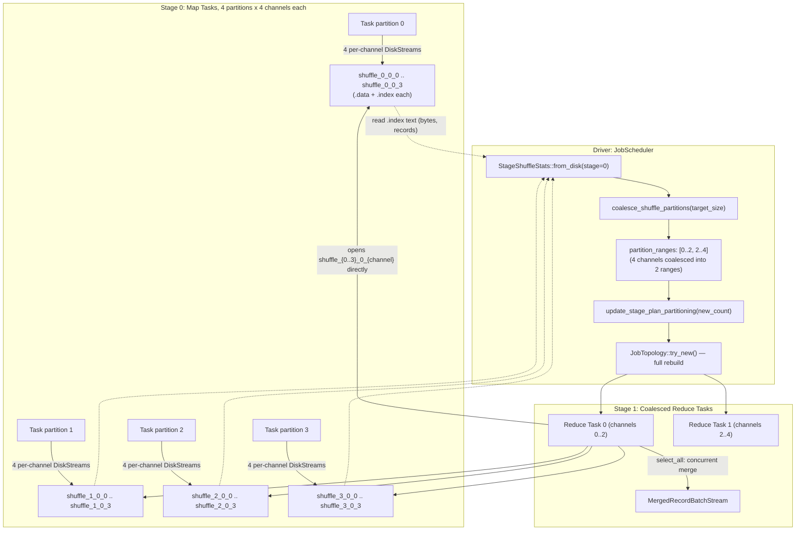

# Summary of Disk-Based Adaptive Shuffle Implementation

## 1. Executive Summary

`sail-execution` normally moves shuffle data between task stages purely in memory (`OutputMode::Pipelined`, Tokio `mpsc` channels), which streams data directly from a running upstream task to a running downstream task. This project adds an alternate, disk-backed shuffle path (`OutputMode::Blocking`, `LocalStreamStorage::Disk`) plus a runtime-statistics layer that can adapt downstream partitioning to the volume of data actually produced, instead of the volume planned at compile time.

Key pieces, as implemented today:

1. **Persistent on-disk shuffle (`DiskStream`)** — one Arrow IPC file per shuffle channel, with a small text index file and atomic rename for crash-safe writes.
2. **Cheap runtime channel statistics** — `StageShuffleStats::from_disk` derives each channel's byte/record size by reading its two-line `.index` file, without opening the (potentially large) `.data` file.
3. **Dynamic partition coalescing** — `coalesce_shuffle_partitions` merges adjacent small channels into `~target_partition_size` groups, and the scheduler rewrites the downstream stage's plan and task count accordingly.
4. **Skew and broadcast-join *detection*** — `detect_skew_partitions` and `should_broadcast_join` compute real signals from the stats, but today only feed a debug log line; no plan mitigation is wired to them yet (see §7 for exact status).
5. **Stage lifecycle decoupling (`OutputMode::Blocking`)** — when active, upstream tasks finish writing to disk and exit before the downstream stage is even scheduled, rather than the two overlapping in time.
6. **Test coverage** — 18 unit/integration tests across `adaptive.rs`, `driver/job_scheduler/core.rs`, and `stream_manager/local.rs` (listed in §6).

This document was last checked against the code at commit `7a112171` (`fix(execution): fix adaptive disk shuffle correctness, topology, streaming, and tests`), which substantially reworked the on-disk layout and reader path from the original `238c95dc`/`24b5897a`/`529baf4b` commits below — several details from the original design/implementation commits (a combined multi-channel data file with a binary offset index, a `TaskInputLocator::LocalDisk` variant) were superseded by the simpler per-channel-file layout described here. **Read [`adaptive-disk-shuffle-design.md`](./adaptive-disk-shuffle-design.md) first** — in particular its "Implementation Status" section, which explains that `OutputMode::Blocking` is fully implemented and tested but not yet the mode a running driver actually selects.

---

## 2. Delivery Timeline & Commit History

```
* 7a112171 - fix(execution): fix adaptive disk shuffle correctness, topology, streaming, and tests
* 4acea9f7 - docs(concepts): add implementation summary for disk-based adaptive shuffle
* 30e0cbb2 - feat(execution): implement disk-based adaptive shuffle coalescing and tests
* 9e0bdb7d - docs: add AGENT.md guidelines for AI agents
* 529baf4b - feat(execution): add LocalDisk locator and index statistics to DiskStream
* 24b5897a - feat(execution): implement DiskStream for local disk-based shuffle
* 238c95dc - docs: add design doc for adaptive disk-based shuffle
```

### Commit details

#### `24b5897a` — implement `DiskStream` for local disk-based shuffle
- Scope: `crates/sail-execution/src/stream_manager/`
- Introduced `DiskStream` and `LocalStreamStorage::Disk`.

#### `529baf4b` — add `LocalDisk` locator and index statistics to `DiskStream`
- Scope: `stream_manager/`, `task/`
- Added an initial index/statistics mechanism. (Superseded by `7a112171`'s simpler per-channel text index — see §1.)

#### `9e0bdb7d` — add `AGENT.md` guidelines for AI agents
- Repository-root operational guidelines; unrelated to the shuffle mechanism itself.

#### `30e0cbb2` — implement disk-based adaptive shuffle coalescing and tests
- Scope: `driver/job_scheduler/`
- Added `adaptive.rs` (`StageShuffleStats`, `coalesce_shuffle_partitions`, `detect_skew_partitions`, `should_broadcast_join`, `split_skew_partition`) and wired coalescing into `JobScheduler::schedule_task_regions`.

#### `4acea9f7` — add implementation summary docs
- The original version of this document and the design doc.

#### `7a112171` — fix adaptive disk shuffle correctness, topology, streaming, and tests
- Reworked the on-disk layout to one `.data`/`.index` pair **per channel** (rather than a combined multi-channel file with a binary offset index).
- Simplified the index file to plain two-line text (`bytes\n`, `records\n`).
- Adjusted topology rebuilding and the shuffle-read merge path.
- This is the version described throughout the rest of this document and the design doc.

---

## 3. Architecture & Data Flow



Note the important correction from the original version of this document: coalescing groups **channels**, and a reduce task assigned a range of channels reads that range **from every upstream map partition** — it does not reduce the number of files opened, it reduces the number of downstream tasks. See design doc §5.4 for the exact merge mechanism (`futures::stream::select_all`, concurrent and unordered).

---

## 4. Key Components

### 4.1 `adaptive.rs` — stats, coalescing, detection

File: `crates/sail-execution/src/driver/job_scheduler/adaptive.rs`

- **`StageShuffleStats::from_disk(shuffle_dir, job_id, stage, partitions, channels, attempts)`**: for every `(map partition, channel)` pair, reads `shuffle_{p}_{attempt}_{c}.index` as UTF-8 text, parses two lines (`bytes`, `records`), and accumulates per-channel and stage-wide totals. Missing/unreadable index files are skipped with a `debug!` log, not an error — a partially-written stage simply reports smaller totals rather than failing.
- **`coalesce_shuffle_partitions(channel_bytes, target)`**: single linear pass; greedily grows a range until the next channel would push it over `target`, then starts a new range. Never splits an individual oversized channel — see design doc §6.1 for the exact algorithm and its guarantees.
- **`detect_skew_partitions(skew_factor, min_skew_threshold)`**: flags channel `c` when `size[c] >= min_skew_threshold` **and** `size[c] > median(nonzero sizes) * skew_factor`. Computed on real data, but its result is currently only logged by the caller (§7).
- **`should_broadcast_join(threshold)`**: `total_bytes > 0 && total_bytes <= threshold`. Also detection-only; the caller passes a hardcoded `10 * 1024 * 1024` rather than a configurable value.
- **`split_skew_partition(num_map_partitions, num_splits)`**: divides the map-partition axis into `num_splits` contiguous chunks so a skewed channel's reads could, in principle, be spread across several reduce tasks. This function is compiled only under `#[cfg(test)]` — no production code calls it today.

### 4.2 `driver/job_scheduler/core.rs` — wiring into the scheduler

- **`optimize_stages_adaptively`**, called from `schedule_task_regions` when `adaptive_enabled`: for each stage with shuffle inputs whose upstream is fully succeeded and in `OutputMode::Blocking`, it gathers `StageShuffleStats`, runs skew/broadcast detection (log-only), coalesces channels, and — if that reduces the partition count — updates `StageInput.partition_ranges`, rewrites the stage's plan via `update_stage_plan_partitioning`, and replaces the stage's task list. If any stage changed, `JobTopology::try_new` rebuilds topology from scratch afterward (there is no targeted "resize this region" call).
- **`get_task_input`**, `InputMode::Shuffle` branch: when `partition_ranges` is set, task `p`'s input keys are every `(channel in ranges[p], every upstream map partition)` pair; otherwise it defaults to one key per `(channel, partition)` with no coalescing.

### 4.3 `stream_manager/` — persistence and lookup

- `stream_manager/local.rs`: `DiskStream` (one channel's file), `DiskStreamWriter` (buffers via `arrow_ipc::writer::StreamWriter`, writes the text index, atomically renames on `close()`).
- `stream_manager/core.rs`: `StreamManager::fetch_local_stream` checks whether the channel's `.data` file already exists on disk (the common case once upstream has fully finished) and reads directly if so, otherwise falls back to the same pending-subscriber/probe mechanism used for in-memory streams. `create_remote_stream`/`fetch_remote_stream` on `StreamManager` are unimplemented stubs; actual cross-node reads go through the separate `stream_service` Arrow Flight server (`stream_service/server.rs`), keyed by a protobuf `TaskStreamTicket{job_id, stage, partition, attempt, channel}` — one ticket per channel, not a byte-range request.

---

## 5. End-to-End Walkthrough

Query: `SELECT department, count(*) FROM employees GROUP BY department;`, with 4 map partitions, 4 shuffle channels, `target_partition_size = 400` bytes, and each map task emitting 50 bytes/channel (200 bytes/channel summed across all 4 map tasks).

```
T0  JobScheduler  schedule_task_regions(): Stage 0 (map, OutputMode::Blocking) region scheduled.
T1  Worker Tasks  Tasks 0..3 each write 4 per-channel DiskStreams:
                  shuffle_{p}_0_{c}.data.tmp + .index.tmp for c in 0..4, p in 0..4
                  on close(): index content is "50\n<rows>\n"; files renamed to final names.
T2  Worker Tasks  All Stage 0 tasks reach TaskState::Succeeded.
T3  JobScheduler  optimize_stages_adaptively(): all_upstream_ready == true for Stage 1's shuffle input.
T4  JobScheduler  StageShuffleStats::from_disk() sums each channel across all 4 map partitions:
                  channel 0..3 each = 200 bytes; total = 800 bytes.
T5  JobScheduler  coalesce_shuffle_partitions([200,200,200,200], target=400):
                  channel 0 (200) + channel 1 (200) = 400 -> range 0..2
                  channel 2 (200) + channel 3 (200) = 400 -> range 2..4
                  2 ranges, down from 4 channels.
T6  JobScheduler  StageInput.partition_ranges = Some([0..2, 2..4]) on Stage 1's shuffle input.
                  update_stage_plan_partitioning(plan, 2): RepartitionExec/StageInputExec -> 2 partitions.
                  Stage 1 tasks reset to 2 fresh task descriptors.
                  JobTopology::try_new(): topology rebuilt; Stage 1's region now has 2 tasks.
T7  JobScheduler  Reduce tasks 0 and 1 scheduled.
                  get_task_input(task 0) -> keys for (channel 0, p 0..4) + (channel 1, p 0..4) = 8 keys.
                  get_task_input(task 1) -> keys for (channel 2, p 0..4) + (channel 3, p 0..4) = 8 keys.
T8  Worker Tasks  ShuffleReadExec opens all 8 sources per task and merges them via
                  futures::stream::select_all (concurrent, no ordering guarantee).
T9  JobScheduler  Once Stage 1's consumers succeed, CleanUpJob{stage: Some(0)} removes Stage 0's directory;
                  job completion removes the whole job directory.
```

---

## 6. Test Coverage

18 tests directly exercise this subsystem (function names are exact, from the current source — this list intentionally excludes unrelated tests that happen to live in the same crate):

**`driver/job_scheduler/adaptive.rs`**
- `test_coalesce_empty`, `test_coalesce_target_zero`, `test_coalesce_all_small_partitions`, `test_coalesce_balanced_partitions`, `test_coalesce_skewed_partition` — `coalesce_shuffle_partitions` edge cases and grouping behavior.
- `test_from_disk_stats` — `StageShuffleStats::from_disk` correctly sums bytes/records across map partitions from real text index files written to a temp dir.
- `test_detect_skew_partitions` — median/threshold skew flagging.
- `test_split_skew_partition` — map-partition range splitting (exercises the test-only helper described in §4.1/§1).
- `test_should_broadcast_join` — byte-threshold check.

**`driver/job_scheduler/core.rs`**
- `test_adaptive_disk_shuffle_coalescing_workflow` — end-to-end: builds a 2-stage plan with `OutputMode::Blocking`, writes real index files simulating 4 small map outputs, and verifies the scheduler coalesces Stage 1 from 4 to 2 partitions.
- `test_adaptive_disabled_preserves_partitions` — same setup with `adaptive_enabled = false`; confirms partitioning is left untouched.
- `test_get_task_input_with_coalesced_ranges` — with `partition_ranges = Some([0..2, 2..4])` set directly, confirms `get_task_input` for partition 0 returns exactly the channel-0 and channel-1 keys.
- `test_disk_shuffle_stage_and_job_cleanup` — confirms `clean_up_stage`/job cleanup actually removes the shuffle directories from disk.
- `test_adaptive_multi_input_coalescing` — a stage with two shuffle inputs (e.g. both sides of a join) gets consistent coalesced ranges.
- `test_task_failure_isolation_in_coalesced_stage` — a failed task within a coalesced region doesn't corrupt sibling tasks' state.

**`stream_manager/local.rs`**
- `test_disk_stream_round_trip` — write then read back a batch through `DiskStream`, checking both the data and the parsed index stats.
- `test_disk_stream_multi_batch_and_empty_batch` — multiple batches including a zero-row batch are all preserved and read back in order for a single channel.
- `test_disk_stream_with_pending_senders` — a subscriber registered before the writer closes gets the batch pushed to it live, *and* a later subscriber can still read the same data back from disk.
- `test_disk_stream_empty_file` — a channel with no batches at all still produces a valid (empty) `.data`/`.index` pair and an empty read stream.

---

## 7. What's Real vs. What's Only Detected

| Capability | Computed from real data? | Acts on the plan/schedule? |
| :--- | :--- | :--- |
| Partition coalescing | Yes | **Yes** — rewrites plan partitioning and task count |
| Data-skew detection | Yes | No — `debug!` log only; `split_skew_partition` is test-only |
| Broadcast-join candidate detection | Yes | No — `debug!` log only; threshold is a hardcoded literal, not configurable |
| `OutputMode::Blocking` in a running driver | N/A | No — `JobSchedulerOptions::from(&DriverOptions)` always produces `Pipelined`; `Blocking` is reachable today only from test code |

See the design doc's "Implementation Status" section for what turning the remaining pieces on would involve.
