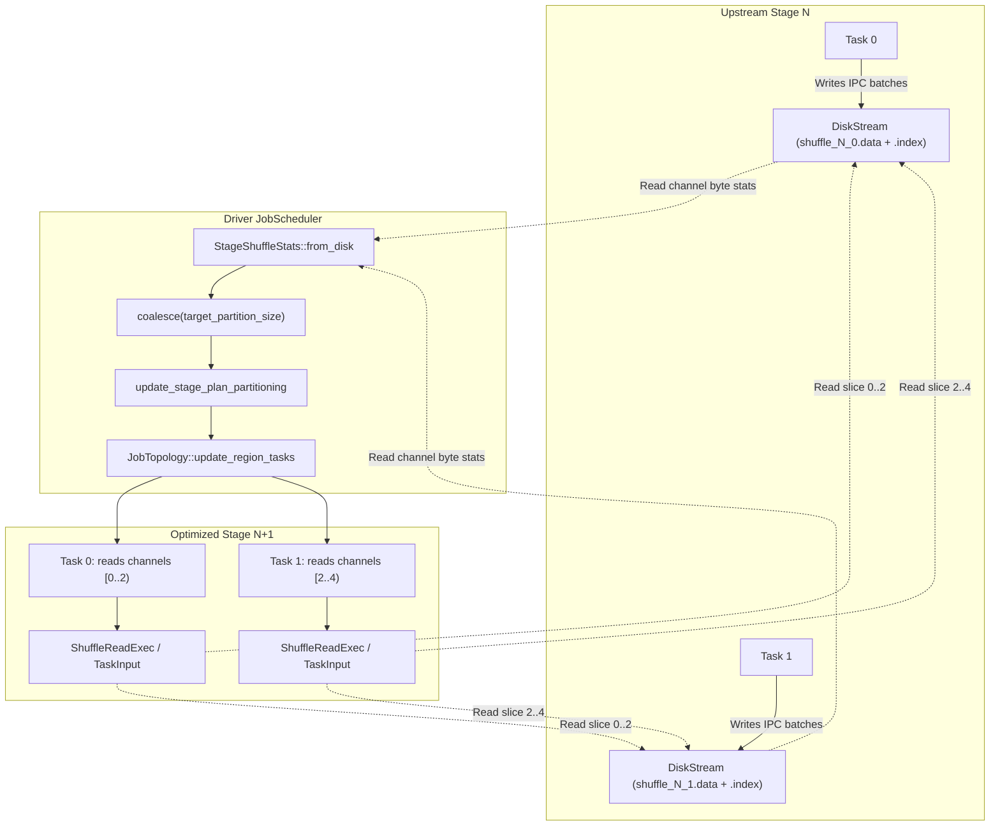

# Summary of Disk-Based Adaptive Shuffle Implementation

## 1. Overview & Objectives

LakeSail's execution engine (`sail-execution`) previously relied solely on in-memory streaming channels (`LocalStreamStorage::Memory`) using Tokio `mpsc` and Arrow Flight. This architecture was prone to out-of-memory errors on large shuffles, coupled upstream/downstream stage lifecycles, and prevented runtime partition adjustment.

To address these limitations, a disk-based adaptive shuffle subsystem was designed and implemented, supporting:
1. **Persistent On-Disk Shuffle (`DiskStream`)**: Memory-bounded execution with binary IPC record batch streaming and channel indexing.
2. **Channel Statistics Inspection**: On-disk `.index` metadata reading to determine exact partition sizes without re-scanning raw data.
3. **Adaptive Query Execution (AQE) Partition Coalescing**: Dynamic post-shuffle partition coalescing to eliminate small partitions and reduce scheduling overhead.
4. **Data Skew Detection & Split Logic**: Identifying skewed channels using median statistics and generating multi-reader ranges.
5. **Decoupled Stage Execution (`OutputMode::Blocking`)**: Stages materialize shuffle files to disk, release their resources, and allow the driver scheduler to optimize downstream stage partitioning before scheduling downstream tasks.

---

## 2. Delivery Timeline & Commits

| Commit | Description |
| :--- | :--- |
| [`24b5897a`](https://github.com/warrenzhu25/sail/commit/24b5897ad2469d7c62f2de829e084fa8df8c42de) | `feat(execution): implement DiskStream for local disk-based shuffle`<br>Added binary IPC stream serialization, `.data` and `.index` file layouts, channel offset seeking, and `LocalStreamStorage::Disk`. |
| [`529baf4b`](https://github.com/warrenzhu25/sail/commit/529baf4b5295f693900dda1f9bd1a55c1aa1f345) | `feat(execution): add LocalDisk locator and index statistics to DiskStream`<br>Added `TaskInputLocator::LocalDisk`, `read_index_stats` and `read_channel_stats` for index metadata queries, and stage/job disk cleanup. |
| [`9e0bdb7d`](https://github.com/warrenzhu25/sail/commit/9e0bdb7db174ebc387f1a6e61dd58fffc3625c44) | `docs: add AGENT.md guidelines for AI agents`<br>Operational standards and conventions for AI-assisted development. |
| [`30e0cbb2`](https://github.com/warrenzhu25/sail/commit/30e0cbb287ddf3f789ee98d41cf9687e148e47eb) | `feat(execution): implement disk-based adaptive shuffle coalescing and tests`<br>Implemented `StageShuffleStats`, dynamic partition coalescing algorithms, adaptive stage plan rewriting, task region resizing, coalesced multi-channel routing in `get_task_input`, and comprehensive unit/integration test suites. |

---

## 3. Architecture & Data Flow



---

## 4. Key Components & Implementation Details

### 4.1 Adaptive Shuffle Module (`adaptive.rs`)
Located at `crates/sail-execution/src/driver/job_scheduler/adaptive.rs`:
- **`StageShuffleStats`**: Aggregates partition byte counts across all map task index files in an upstream stage:
  ```rust
  pub struct StageShuffleStats {
      pub stage: usize,
      pub num_channels: usize,
      pub channel_bytes: Vec<u64>,
      pub total_bytes: u64,
  }
  ```
- **`coalesce(target_partition_size)`**: Iterates linearly across channels $[0, C)$, accumulating bytes into partition chunks. When the accumulated size exceeds `target_partition_size`, a boundary is created.
- **`detect_skew_partitions(skew_factor, min_skew_threshold)`**: Identifies partition outliers exceeding `median * skew_factor` and exceeding `min_skew_threshold`.
- **`split_skew_partition(num_map_partitions, num_splits)`**: Generates sub-ranges of map tasks so multiple reduce tasks can read slices of a single skewed channel in parallel.
- **`should_broadcast_join(auto_broadcast_threshold)`**: Evaluates whether total output bytes are small enough to convert a downstream shuffle join into a broadcast join.

### 4.2 Job Scheduler & Plan Rewriting (`core.rs` & `topology.rs`)
- **`optimize_region_adaptively`**:
  1. Inspects completed upstream stages that feed into the current region's stages.
  2. Aggregates shuffle statistics via `StageShuffleStats::from_disk`.
  3. Computes coalesced `partition_ranges` (e.g., `vec![0..2, 2..4]`).
  4. Calls `update_stage_plan_partitioning` to recursively replace `Partitioning::RoundRobinBatch(N)` or `Partitioning::Hash(exprs, N)` with the coalesced partition count $M$.
  5. Resizes stage task sets and updates `region.tasks` via `JobTopology::update_region_tasks`.
- **`get_task_input`**:
  - When `input.partition_ranges` is present, retrieves stream channel keys for all channels in `partition_ranges[task.partition]` and aggregates them into the task's input locator.

### 4.3 Disk Stream Lifecycle & Storage (`stream_manager`)
- **`DiskStream`**: Writes Arrow IPC record batches with 8-byte length framing to `.data`, alongside an 8-byte cumulative offset array in `.index`.
- **Stream Recovery (`fetch_local_stream`)**: If a task requests an on-disk stream that is not actively registered in memory, `fetch_local_stream` discovers the files in `shuffle_dir` and instantiates a `DiskStream` reader on demand.
- **Cleanup**: `JobScheduler::stop_job` and `clean_up_stage` remove stage-specific and job-specific shuffle directories from disk once consumed or upon job completion.

---

## 5. Verification & Test Suite

The feature is verified by 16 tests in `crates/sail-execution`:

| Test Name | File | Description |
| :--- | :--- | :--- |
| `test_from_disk_stats` | `adaptive.rs` | Verifies index file byte calculation across multiple map tasks. |
| `test_coalesce_all_small_partitions` | `adaptive.rs` | Tests merging 8 small channels (100B each) into 2 coalesced groups (target 400B). |
| `test_coalesce_balanced_partitions` | `adaptive.rs` | Ensures balanced partitions (400B each) are preserved as 1:1 mappings. |
| `test_coalesce_skewed_partition` | `adaptive.rs` | Ensures a large skewed channel (5000B) forms its own isolated partition. |
| `test_coalesce_empty` / `test_coalesce_target_zero` | `adaptive.rs` | Validates boundary conditions and 0-target fallback. |
| `test_detect_skew_partitions` | `adaptive.rs` | Verifies median-based skew partition detection. |
| `test_split_skew_partition` | `adaptive.rs` | Verifies chunk calculation for skew partition split readers. |
| `test_should_broadcast_join` | `adaptive.rs` | Verifies broadcast join size threshold checks. |
| `test_adaptive_disk_shuffle_coalescing_workflow` | `core.rs` | End-to-end integration test: creates disk index files, executes adaptive stage re-planning, verifies partition reduction from 4 to 2, and schedules tasks. |
| `test_get_task_input_with_coalesced_ranges` | `core.rs` | Verifies channel key distribution to coalesced partition tasks. |
| `test_adaptive_disabled_preserves_partitions` | `core.rs` | Verifies standard execution preserves original partition counts when adaptive execution is disabled. |
| `test_disk_shuffle_stage_and_job_cleanup` | `core.rs` | Verifies recursive cleanup of shuffle directories on disk. |
| `test_disk_stream_round_trip` | `local.rs` | Verifies reading back specific channels from `.data` and `.index` files. |
