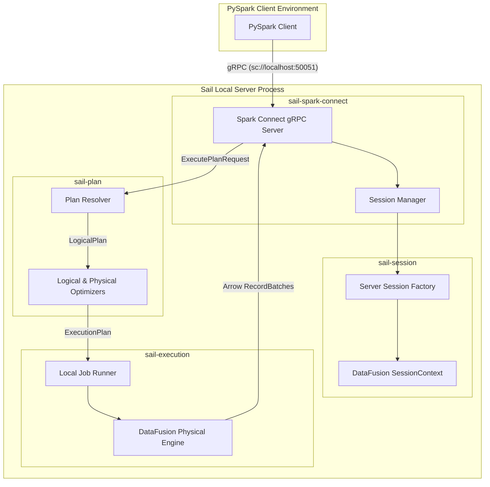
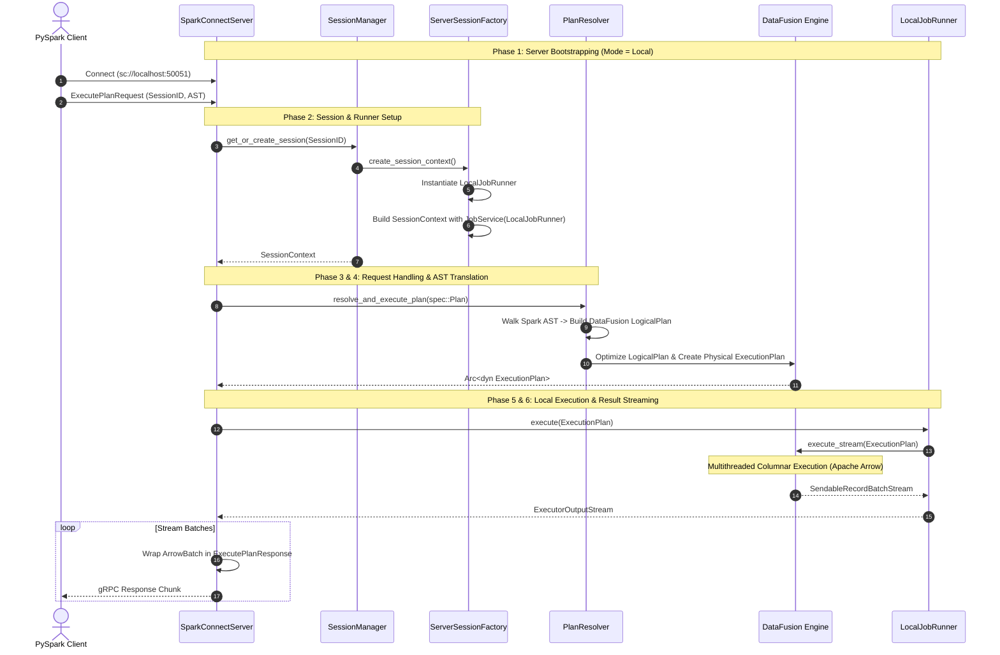

# Sail Local Execution Architecture Guide

Sail is a Rust-native, drop-in replacement for Apache Spark that eliminates JVM overhead while maintaining full compatibility with the Spark DataFrame and SQL APIs. It achieves this by implementing the Spark Connect gRPC protocol and leveraging Apache DataFusion as its underlying query engine.

This guide provides a comprehensive, architectural deep-dive into how Sail executes Spark workloads locally. It is designed to give contributors a complete understanding of the system's internal mechanics, request lifecycle, and component interactions without requiring an immediate dive into the source code.

---

## System Topology & Key Components

When running locally, Sail operates entirely within a single OS process while parallelizing workload execution across CPU threads. The architecture is modularized across several specialized crates:



*   **`sail-spark-connect`**: Implements the official Spark Connect gRPC service definitions. It acts as the gateway, accepting incoming connection requests and raw Spark execution plans.
*   **`sail-session`**: Manages the lifecycle of user sessions, isolating configurations, catalogs, and runtime environments for concurrent connections.
*   **`sail-plan`**: The compiler layer. It translates Spark Connect ASTs (Abstract Syntax Trees) into DataFusion logical plans, applies custom optimization rules, and generates physical execution plans.
*   **`sail-execution`**: The execution driver. In local mode, it bridges DataFusion's physical execution engine with Sail's job tracking and streaming infrastructure.

---

## Detailed Lifecycle of a Local Spark Query

To understand how Sail runs Spark locally, we trace the end-to-end lifecycle of a PySpark script executing a DataFrame action (e.g., `df.filter(...).show()`).



### Phase 1: Server Bootstrapping & Configuration

1.  **Startup**: The user launches the Sail server locally (e.g., `sail spark server --port 50051` or via the Python `SparkConnectServer` API).
2.  **Config Loading**: Sail initializes its configuration hierarchy ([`AppConfig`](file:///usr/local/google/home/warrenzhu/sail/crates/sail-common/src/config/application.rs#L20)). By default, `mode` is set to `Local` ([`application.yaml`](file:///usr/local/google/home/warrenzhu/sail/crates/sail-common/src/config/application.yaml#L3)).
3.  **gRPC Binding**: The server binds a Tokio TCP listener to the specified port and mounts the `SparkConnectServiceServer` gRPC service ([`entrypoint.rs`](file:///usr/local/google/home/warrenzhu/sail/crates/sail-spark-connect/src/entrypoint.rs#L16-L40)). It configures compression (Gzip/Zstd) and maximum message decoding limits to match Spark standards.

### Phase 2: Client Connection & Session Setup

When the PySpark client connects and initiates an operation, it provides a `session_id`. Sail guarantees session isolation without spinning up separate OS processes:

1.  **Session Lookup/Creation**: `SparkConnectServer` requests a `SessionContext` from the `SessionManager` ([`server.rs`](file:///usr/local/google/home/warrenzhu/sail/crates/sail-spark-connect/src/server.rs#L137)). If the session does not exist, `SessionManager` invokes `ServerSessionFactory::create` ([`server.rs`](file:///usr/local/google/home/warrenzhu/sail/crates/sail-session/src/session_factory/server.rs#L88)).
2.  **Custom Catalog Injection**: Instead of using DataFusion's default memory catalog, Sail injects its own specialized catalog managers (supporting Delta Lake, Iceberg, Hive Metastore, Unity Catalog) into the session configuration.
3.  **Job Runner Attaching**: The session factory inspects `config.mode`. Seeing `ExecutionMode::Local`, it instantiates a `LocalJobRunner` ([`job_runner.rs`](file:///usr/local/google/home/warrenzhu/sail/crates/sail-execution/src/job_runner.rs#L18)).
4.  **Service Registration**: The `LocalJobRunner` is wrapped inside a `JobService` extension and registered directly into the DataFusion `SessionConfig`. This binds the specific local execution mechanism to the user's session context.

### Phase 3: Request Interception

The PySpark client transmits an `ExecutePlanRequest` containing a serialized protobuf representation of the Spark query plan.

1.  **Routing**: `SparkConnectServer::execute_plan` receives the request. It inspects the root operation type of the incoming plan.
2.  **Branching**:
    *   If the plan is a **Command** (e.g., DDL statement, UDF registration, streaming query management, or writing data), it routes to `handle_command`. Commands are typically executed eagerly and silently ([`server.rs`](file:///usr/local/google/home/warrenzhu/sail/crates/sail-spark-connect/src/server.rs#L52)).
    *   If the plan is a **Relation** (a standard DataFrame query), it routes to `handle_execute_relation`. Relations are executed lazily to stream results back to the client.

### Phase 4: AST Translation (`PlanResolver`)

Before DataFusion can execute the query, Sail must compile the Spark Connect AST into a DataFusion `LogicalPlan`. This is performed by `resolve_and_execute_plan` ([`lib.rs`](file:///usr/local/google/home/warrenzhu/sail/crates/sail-plan/src/lib.rs#L34)), which instantiates a `PlanResolver`.

The `PlanResolver` ([`mod.rs`](file:///usr/local/google/home/warrenzhu/sail/crates/sail-plan/src/resolver/query/mod.rs#L40)) recursively traverses the Spark AST nodes and performs complex transformations:

*   **Reads & Scans**: Translates Spark table scans (`ReadType::NamedTable`, `DataSource`) into DataFusion `TableScan` logical nodes, interacting with Sail's custom catalogs to resolve schemas and file locations.
*   **Transformations**: Maps relational operators (`Project`, `Filter`, `Join`, `Sort`, `Aggregate`, `Limit`, `SetOperation`) into their corresponding DataFusion logical builder representations.
*   **Expression Resolution**: Converts Spark SQL expressions, literals, functions, and column references into DataFusion `Expr` structs. It maintains a tracking state (`PlanResolverState`) to handle Spark's complex column aliasing, hidden metadata fields, and scope resolution.
*   **UDF Integration**: Resolves Python/Pandas/Arrow UDFs and User-Defined Table Functions (UDTFs), binding them to DataFusion's function registry.

### Phase 5: Logical Optimization & Physical Planning

Once the raw DataFusion `LogicalPlan` is constructed, Sail prepares it for physical execution:

1.  **Logical Optimization**: DataFusion's core optimizer executes standard rule passes (e.g., projection pushdown, filter pushdown, constant folding). Sail also injects custom analyzer and optimizer rules (e.g., join reordering, view type coercion at output boundaries).
2.  **Streaming Adjustments**: If the plan involves micro-batch streaming, Sail rewrites the logical plan to accommodate streaming sources and sinks.
3.  **Physical Planning**: Sail invokes DataFusion's `QueryPlanner` (`session_state.create_physical_plan(...)`). This converts logical nodes into a physical `ExecutionPlan` (e.g., converting a logical join into a physical Hash Join or Sort-Merge Join based on statistics and partitioning).

### Phase 6: Native Local Execution (`LocalJobRunner`)

With the physical `ExecutionPlan` ready, Sail hands execution back to the session's `JobService`.

1.  **Retrieving the Runner**: The executor calls `service.runner().execute(ctx, plan)` ([`plan_executor.rs`](file:///usr/local/google/home/warrenzhu/sail/crates/sail-spark-connect/src/service/plan_executor.rs#L132)). In local mode, this resolves to `LocalJobRunner::execute`.
2.  **In-Process Invocation**:
    ```rust
    // From sail-execution/src/job_runner.rs
    #[tonic::async_trait]
    impl JobRunner for LocalJobRunner {
        async fn execute(
            &self,
            ctx: &SessionContext,
            plan: Arc<dyn ExecutionPlan>,
        ) -> Result<SendableRecordBatchStream> {
            // 1. Assign internal Job ID and setup OpenTelemetry tracing
            let job_id = self.next_job_id.fetch_add(1, Ordering::Relaxed);
            let plan = trace_execution_plan(plan, options)?;
            
            // 2. Delegate to native DataFusion execution
            Ok(execute_stream(plan, ctx.task_ctx())?)
        }
    }
    ```
3.  **DataFusion Engine Execution**: `datafusion::physical_plan::execute_stream` runs the plan. DataFusion spawns asynchronous tasks across the local Tokio thread pool. It scans files from storage, evaluates vectorized expressions using SIMD instructions, and processes data purely in columnar Apache Arrow memory format without JVM garbage collection pauses.

### Phase 7: Result Conversion & Streaming

The output of `execute_stream` is a `SendableRecordBatchStream`—an asynchronous stream of Apache Arrow `RecordBatch`es.

1.  **Executor Wrapping**: Sail wraps this stream inside an `Executor` struct ([`plan_executor.rs`](file:///usr/local/google/home/warrenzhu/sail/crates/sail-spark-connect/src/service/plan_executor.rs#L137)), which manages heartbeats (`spark.execution_heartbeat_interval`) to keep the gRPC connection alive during long-running local computations.
2.  **Response Stream Generation**: `ExecutePlanResponseStream` ([`plan_executor.rs`](file:///usr/local/google/home/warrenzhu/sail/crates/sail-spark-connect/src/service/plan_executor.rs#L55)) consumes the record batches.
3.  **Serialization**: For each `RecordBatch`, Sail serializes the Arrow IPC data into an `ExecutePlanResponse` protobuf message (`ResponseType::ArrowBatch`).
4.  **Transmission**: The gRPC server streams these response chunks back to the PySpark client over the open TCP socket.
5.  **Client Materialization**: PySpark receives the Arrow batches and deserializes them instantly into a client-side Spark DataFrame (or Pandas/Arrow structure), completing the execution loop.

---

## Key Architectural Highlights & Design Choices

### 1. Zero JVM Overhead
Unlike traditional local Spark deployments that require booting a local JVM (leading to heavy memory footprint and slow startup times), Sail’s local mode runs entirely as a compiled Rust binary. Data processing occurs in C/Rust memory space using Apache Arrow arrays.

### 2. In-Process Isolation vs. Cluster Emulation
Sail distinguishes between `Local` mode and `LocalCluster` mode:
*   **`Local` Mode**: Executes physical plans directly inside the server process via DataFusion's multithreaded execution model. There is no RPC communication between "driver" and "worker" nodes.
*   **`LocalCluster` Mode**: Emulates a full distributed cluster within a single process by spawning distinct driver and worker actors that communicate over local RPC channels. `Local` mode avoids this RPC serialization overhead entirely.

### 3. Python Integration via Arrow Pointers
When local PySpark code registers Python UDFs or User-Defined Data Sources, Sail executes the Python code using embedded PyO3/Python runtimes. Because both Sail and Python (via PyArrow/Pandas) operate on Apache Arrow data, data is shared between the Rust execution engine and Python UDFs via zero-copy Arrow array pointers, bypassing serialization bottlenecks.

### 4. Memory Pool Management
During local execution, memory allocation is tightly governed by DataFusion's `MemoryPool` configurations ([`application.rs`](file:///usr/local/google/home/warrenzhu/sail/crates/sail-common/src/config/application.rs#L98)). Sail supports `Unbounded`, `Greedy`, and `Fair` memory pools, ensuring that intensive local joins or aggregations do not cause out-of-memory (OOM) crashes on the host machine.
