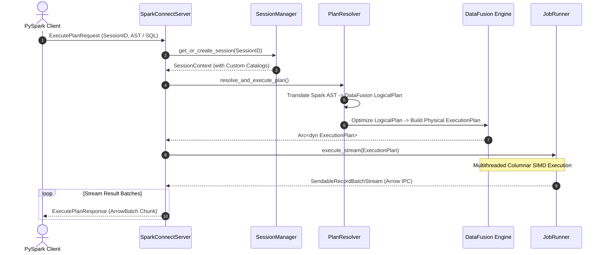

# Sail: High-Level Architecture & Component Deep Dive

This guide provides a comprehensive architectural overview and deep-dive analysis of **Sail**, a 100% Rust-native drop-in replacement for Apache Spark. It is designed to help new engineers and contributors understand the system topology, request lifecycle, and internal mechanics across all major crates.

---

## 1. High-Level System Overview

### System Purpose & Value Proposition
Sail unifies batch processing, stream processing, and AI workloads into a single, high-performance distributed compute engine. By implementing the official **Spark Connect gRPC protocol**, Sail acts as a transparent, drop-in replacement for Apache Spark. Existing PySpark applications (using DataFrames or Spark SQL) can execute directly on Sail with **zero code rewrites**, achieving up to 4–8× faster execution times and 94% lower infrastructure costs by eliminating JVM overhead and garbage collection pauses.

### Core Architecture
Sail is built on a columnar, vectorized memory model powered by **Apache Arrow** and **Apache DataFusion**. It operates seamlessly across two primary deployment topologies:
* **Local Mode:** Operates as a single OS process, parallelizing workload execution across CPU threads via Tokio. Ideal for ad-hoc analytics, development, and testing.
* **Cluster Mode:** Operates as a fully distributed master-worker system with a strict separation between the **Control Plane** (Actor model over gRPC for task scheduling) and the **Data Plane** (Arrow Flight gRPC for distributed data shuffling).

```mermaid
graph TD
    subgraph PySpark Client Environment
        Client[PySpark Client / pysail]
    end

    subgraph Sail Architecture
        SC[Spark Connect gRPC Gateway]
        SM[Session & Catalog Manager]
        SQL[SQL Parser & AST Resolver]
        OPT[Logical & Physical Optimizers]
        
        subgraph Execution Engine
            Local[Local Job Runner / Tokio]
            Cluster[Cluster Driver & Workers / Arrow Flight]
        end
    end

    Client -- "sc://localhost:50051" --> SC
    SC --> SM
    SM --> SQL
    SQL -- "Logical Plan" --> OPT
    OPT -- "Physical Plan" --> Execution Engine
```

---

## 2. System Boundary & High-Level Data Flow

### External Interfaces
* **Upstream Consumers:** PySpark clients, Python scripts, Jupyter notebooks, and BI tools communicating over the Spark Connect protocol (`sc://...`).
* **Downstream Storage & Catalogs:** Cloud object stores (AWS S3, GCS, Azure, Cloudflare R2, HDFS), Lakehouse table formats (Delta Lake, Apache Iceberg), and external metadata catalogs (Hive Metastore, AWS Glue, Unity Catalog, Iceberg REST, OneLake).

### End-to-End Request Lifecycle (Local Execution)



---

## 3. Component Deep Dives

Sail's codebase is highly modularized inside the `crates/` directory. Below is a detailed deep dive into each architectural layer.

### A. Gateway & Server Layer (`sail-spark-connect`, `sail-server`, `sail-cli`)
* **Responsibility:** Serves as the external ingress point for client connections, implementing the standard Spark Connect gRPC service definitions.
* **Internal Logic & Mechanics:** 
  * Binds a Tokio TCP listener and exposes the `SparkConnectServiceServer` gRPC service.
  * Intercepts incoming `ExecutePlanRequest` protobuf messages.
  * Routes operational requests into two distinct paths: **Commands** (e.g., DDL, UDF registration, eager execution) and **Relations** (lazy DataFrame execution requiring result streaming).
  * Manages gRPC response streaming, wrapping resulting Apache Arrow record batches into `ExecutePlanResponse` chunks while maintaining background execution heartbeats.

### B. Session & Catalog Layer (`sail-session`, `sail-catalog`, `sail-catalog-*`)
* **Responsibility:** Isolates user state, runtime configurations, and metadata access across concurrent client connections.
* **Internal Logic & Mechanics:**
  * `SessionManager` tracks active client sessions and instantiates underlying DataFusion `SessionContext` structures.
  * Replaces DataFusion's default memory catalog with specialized, modularized catalog providers:
    * `sail-catalog-delta`: Integrates with Delta Lake tables.
    * `sail-catalog-iceberg`: Integrates with Apache Iceberg REST catalogs.
    * `sail-catalog-glue` / `sail-catalog-hms` / `sail-catalog-unity`: Bridges external cloud metadata stores (AWS Glue, Hive Metastore, Databricks Unity Catalog).

### C. Compiler & Planning Layer (`sail-plan`, `sail-sql-parser`, `sail-sql-analyzer`, `sail-*-optimizer`)
* **Responsibility:** Acts as the query compiler, translating raw SQL strings and Spark Connect ASTs into highly optimized DataFusion execution plans.
* **Internal Logic & Mechanics:**
  * **SQL Parsing:** `sail-sql-parser` uses custom Rust parser combinators and procedural macros (`sail-sql-macro`) to support the complete Spark SQL dialect with production-grade accuracy.
  * **AST Resolution:** `PlanResolver` recursively traverses Spark AST nodes, converting table scans, projections, filters, and joins into a DataFusion `LogicalPlan`.
  * **Custom Optimizers:** `sail-logical-optimizer` and `sail-physical-optimizer` apply specialized optimization rules (e.g., view type coercion, join reordering, and micro-batch streaming adjustments) on top of DataFusion's built-in rule passes.

### D. Execution & Distributed Engine (`sail-execution`, `sail-flight`, `sail-worker`)
* **Responsibility:** Drives the actual physical execution of query plans, managing threads, distributed shuffling, and cluster scheduling.
* **Internal Logic & Mechanics:**
  * **Local Mode (`LocalJobRunner`):** Directly evaluates physical `ExecutionPlan` streams inside the local Tokio thread pool using SIMD vectorized instructions.
  * **Cluster Mode:** Employs an **Actor Model** (lock-free state management) where a Cluster Driver schedules physical execution across distributed stages.
  * **Data Shuffling (`sail-flight`):** Workers do not communicate via the control plane. Instead, they exchange columnar Arrow shuffle data directly over **Arrow Flight gRPC**, eliminating disk write bottlenecks and shuffle spill.

---

## 4. Cross-Cutting Concerns

### Lakehouse & Storage Storage Integration (`sail-object-store`, `sail-delta-lake`, `sail-iceberg`)
Sail abstracts underlying storage IO via `object_store`. It supports high-throughput asynchronous reads/writes to AWS S3, Azure, GCS, Cloudflare R2, and HDFS. Native integration with Delta Lake and Apache Iceberg ensures ACID compliance and metadata-driven table pruning.

### Python & UDF Integration (`sail-python`, `sail-python-udf`, `sail-function`)
> [!TIP]
> **Zero-Copy Python Execution:** Unlike Spark, which suffers heavy serialization penalties moving data between the JVM and Python processes, Sail runs Python UDFs/UDAFs with zero serialization overhead. Because both Sail's Rust engine and Python (via PyArrow/Pandas) use Apache Arrow memory layouts, data is shared instantly via **in-memory Arrow array pointers**.

### Observability & Telemetry (`sail-telemetry`, `sail-common`)
Execution plans and system actors are heavily instrumented using `tracing` and OpenTelemetry. Every query execution is assigned a unique internal Job ID, allowing full distributed tracing across physical plan evaluation, catalog resolution, and network IO.

---

## 5. Recommended Learning Path & Exploration

If you are diving into the codebase for the first time, follow this recommended learning path:

### 1. Where to Start
* **Server Ingress:** Explore [`crates/sail-spark-connect/src/server.rs`](file:///usr/local/google/home/warrenzhu/sail/crates/sail-spark-connect/src/server.rs) to understand how client gRPC requests are received and routed.
* **AST Compilation:** Review [`crates/sail-plan/src/resolver/query/mod.rs`](file:///usr/local/google/home/warrenzhu/sail/crates/sail-plan/src/resolver/query/mod.rs) to see how Spark Connect AST structures are translated into DataFusion logical plans.
* **Local Runner:** Examine [`crates/sail-execution/src/job_runner.rs`](file:///usr/local/google/home/warrenzhu/sail/crates/sail-execution/src/job_runner.rs) to observe native multithreaded execution.

### 2. Key Workflows to Trace in an IDE
1. **DataFrame Action Execution:** Place a breakpoint in `SparkConnectServer::execute_plan` and submit a simple query via PySpark (`spark.sql("SELECT 1 + 1").show()`). Trace the request through `SessionManager`, `PlanResolver`, and `LocalJobRunner`.
2. **UDF Registration:** Trace how a Python UDF is registered and invoked by inspecting `sail-python-udf` and its binding into the DataFusion function registry.
