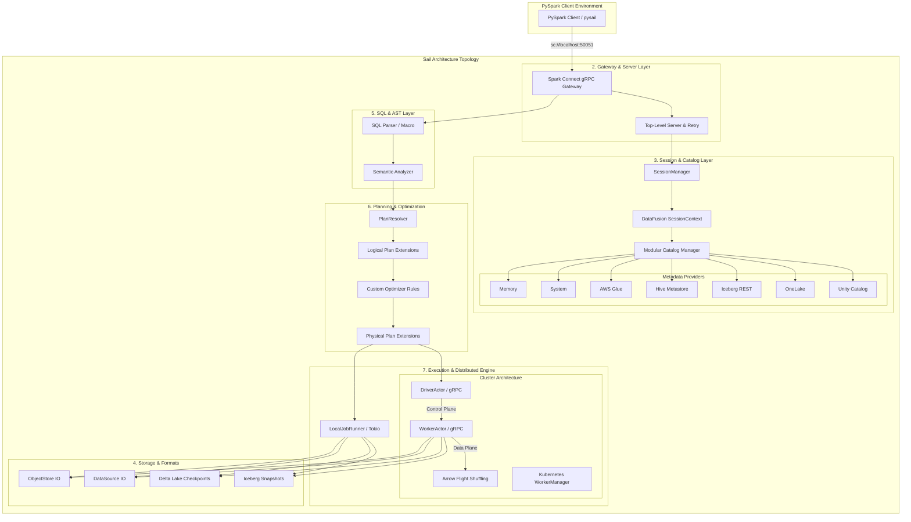
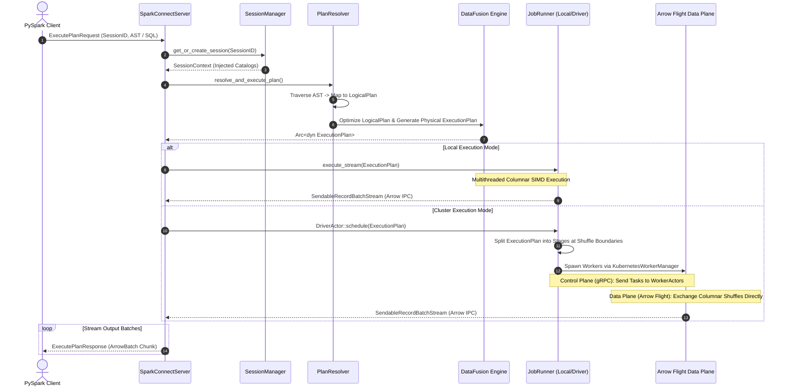

# Sail: Ultra-Thorough Component Deep Dive & Master Reference

This document is an exhaustive, production-grade architectural reference for **Sail**, a 100% Rust-native drop-in replacement for Apache Spark. It bridges high-level system topology with concrete, code-level execution mechanics across **all 36 crates**, detailing memory layouts, wire protocols, concurrency models, and failure modes.

---

## 1. Executive Summary & System Topology

### System Value Proposition & Target Workloads
Sail unifies distributed batch processing, continuous streaming, and compute-intensive AI workloads on a multithreaded, vectorized engine. Operating as a drop-in replacement for Apache Spark over the **Spark Connect gRPC protocol**, Sail eliminates JVM memory overhead, garbage collection pauses, and serialization bottlenecks, achieving up to 4–8× faster execution times and 94% lower infrastructure costs.

### High-Level Architecture & Topology
Sail is built on a vectorized, columnar memory model powered by **Apache Arrow** and **Apache DataFusion**. It operates seamlessly across two deployment topologies:
* **Local Mode:** Runs as a single compiled Rust process, parallelizing execution across CPU cores via Tokio thread pools.
* **Cluster Mode:** Operates as a fully distributed master-worker system with a strict decoupling between the **Control Plane** (Actor model over gRPC for distributed scheduling) and the **Data Plane** (Arrow Flight gRPC for direct worker-to-worker columnar shuffling).



---

## 2. End-to-End Request Lifecycle & Wire Protocols

### Wire Protocol Definitions
Client sessions communicate via the official Spark Connect protobuf definitions (`spark.connect.v1`). Incoming payloads contain serialized Abstract Syntax Trees (ASTs) representing relational expressions or DDL commands.

### 8-Phase Execution Sequence (Local vs. Distributed)



### Data Plane vs. Control Plane Decoupling
* **Control Plane:** Driven by `DriverActor` and `WorkerActor` instances communicating via internal Sail gRPC RPCs (`TaskAssigner`, `Heartbeat`, `StatusReport`). Workers do not talk to each other in the control plane.
* **Data Plane:** Driven by `sail-flight`. When a stage requires shuffling data across partitions, workers stream columnar Arrow IPC buffers directly to peer workers over Arrow Flight gRPC endpoints, completely bypassing disk IO and driver bottlenecks.

---

## 3. Exhaustive Component Deep Dives (All 36 Crates)

```mermaid
graph TD
    subgraph 1. Infrastructure & Utilities
        SCM[sail-common]
        SCD[sail-common-datafusion]
        TEL[sail-telemetry]
        CACHE[sail-cache]
        BUILD[sail-build-scripts]
        GOLD[sail-gold-test]
    end

    subgraph 2. Server, Ingress & CLI
        CLI[sail-cli]
        SRV[sail-server]
        CONN[sail-spark-connect]
        FLIGHT[sail-flight]
    end

    subgraph 3. Session & Catalogs
        SESS[sail-session]
        CAT[sail-catalog]
        MEM[sail-catalog-memory]
        SYS[sail-catalog-system]
        GLUE[sail-catalog-glue]
        HMS[sail-catalog-hms]
        ICE[sail-catalog-iceberg]
        ONE[sail-catalog-onelake]
        UNITY[sail-catalog-unity]
    end

    subgraph 4. Storage & Formats
        OBJ[sail-object-store]
        DS[sail-data-source]
        DL[sail-delta-lake]
        ICETAB[sail-iceberg]
    end

    subgraph 5. SQL Parsing & Analysis
        MACRO[sail-sql-macro]
        PARSER[sail-sql-parser]
        ANALYZER[sail-sql-analyzer]
    end

    subgraph 6. Planning & Optimization
        PLAN[sail-plan]
        LAKEPLAN[sail-plan-lakehouse]
        LPLAN[sail-logical-plan]
        PPLAN[sail-physical-plan]
        LOPT[sail-logical-optimizer]
        POPT[sail-physical-optimizer]
    end

    subgraph 7. Execution & Functions
        EXEC[sail-execution]
        FUNC[sail-function]
        PY[sail-python]
        UDF[sail-python-udf]
    end

    CONN --> SESS
    SESS --> CAT
    CONN --> PLAN
    PARSER --> ANALYZER
    PLAN --> LPLAN
    LPLAN --> LOPT
    LOPT --> PPLAN
    PPLAN --> POPT
    POPT --> EXEC
```

### Subsystem 1: Common Infrastructure & Utilities

#### [`sail-common`](file:///usr/local/google/home/warrenzhu/sail/crates/sail-common)
* **Core Responsibility:** Foundational data structures, application config loading (`application.yaml`), global error definitions, and runtime utilities.
* **Key Structs/Traits:** `AppConfig`, `ExecutionMode` (`Local`, `LocalCluster`, `Cluster`), `MemoryPoolConfig`.
* **Memory & Concurrency:** Manages DataFusion `MemoryPool` allocations (`Unbounded`, `Greedy`, `Fair`) to prevent out-of-memory crashes during intensive aggregations.

#### [`sail-common-datafusion`](file:///usr/local/google/home/warrenzhu/sail/crates/sail-common-datafusion)
* **Core Responsibility:** Bridge utilities and type extensions connecting Apache DataFusion types with Sail's internal runtime specifications.

#### [`sail-telemetry`](file:///usr/local/google/home/warrenzhu/sail/crates/sail-telemetry)
* **Core Responsibility:** Distributed tracing, structured logging (`tracing`), and OpenTelemetry metric pipelines.
* **Key Structs/Traits:** Assigns atomic, monotonic **Job IDs** to track distributed execution graphs across network boundaries.

#### [`sail-cache`](file:///usr/local/google/home/warrenzhu/sail/crates/sail-cache)
* **Core Responsibility:** In-memory and distributed caching abstractions for execution metadata, catalog schemas, and intermediate shuffle buffers.

#### [`sail-build-scripts`](file:///usr/local/google/home/warrenzhu/sail/crates/sail-build-scripts) & [`sail-gold-test`](file:///usr/local/google/home/warrenzhu/sail/crates/sail-gold-test)
* **Core Responsibility:** `sail-build-scripts` compiles protobufs and executes build-time code generation. `sail-gold-test` provides a golden master regression framework validating query plan ASTs against known execution benchmarks.

---

### Subsystem 2: Server, Ingress & CLI

#### [`sail-spark-connect`](file:///usr/local/google/home/warrenzhu/sail/crates/sail-spark-connect)
* **Core Responsibility:** Implements the Spark Connect gRPC protocol, managing client session ingress, plan execution, and result chunking.
* **Key Structs/Traits:** `SparkConnectServer`, `SparkConnectServiceServer`, `Executor`, `ExecutePlanResponseStream`.
* **Algorithmic Mechanics:** Intercepts `ExecutePlanRequest`. Routes eager DDL/UDF operations to `handle_command`, and lazy DataFrame evaluations to `handle_execute_relation`. Serializes Arrow IPC batches into `ExecutePlanResponse` chunks while transmitting execution heartbeats.

#### [`sail-server`](file:///usr/local/google/home/warrenzhu/sail/crates/sail-server)
* **Core Responsibility:** Top-level server lifecycle orchestration, Tokio TCP listener binding, graceful shutdowns, and gRPC retry policies.
* **Key Structs/Traits:** `ServerBuilder`, `ServerActor`, `RetryPolicy`.

#### [`sail-flight`](file:///usr/local/google/home/warrenzhu/sail/crates/sail-flight)
* **Core Responsibility:** Implements the **Data Plane** for cluster mode. Utilizes Apache Arrow Flight gRPC endpoints to stream columnar shuffle data directly across worker nodes.
* **Key Structs/Traits:** `FlightService`, `FlightSession`, `ShuffleFlightClient`.

#### [`sail-cli`](file:///usr/local/google/home/warrenzhu/sail/crates/sail-cli)
* **Core Responsibility:** Command-line interface binary (`sail spark server --port 50051`) bootstrapping standalone local or distributed cluster instances.

---

### Subsystem 3: Session & Catalog Management

#### [`sail-session`](file:///usr/local/google/home/warrenzhu/sail/crates/sail-session)
* **Core Responsibility:** Manages active client sessions, isolating runtime state, catalog configurations, and attaching specific execution runners (`LocalJobRunner`, `DriverActor`) to DataFusion `SessionContext` instances.
* **Key Structs/Traits:** `SessionManager`, `ServerSessionFactory`, `SessionContext`.

#### [`sail-catalog`](file:///usr/local/google/home/warrenzhu/sail/crates/sail-catalog)
* **Core Responsibility:** Replaces DataFusion's default memory catalog with a modular, multi-provider catalog framework supporting temporary views, persistent tables, and DDL statements.
* **Key Structs/Traits:** `CatalogManager`, `CatalogProvider`, `TempViewManager`.

#### Metadata Catalog Providers
* **[`sail-catalog-memory`](file:///usr/local/google/home/warrenzhu/sail/crates/sail-catalog-memory):** Volatile in-memory catalog for temporary tables and test isolation.
* **[`sail-catalog-system`](file:///usr/local/google/home/warrenzhu/sail/crates/sail-catalog-system):** Exposes internal system tables, runtime metrics, and cluster worker statuses.
* **[`sail-catalog-glue`](file:///usr/local/google/home/warrenzhu/sail/crates/sail-catalog-glue):** AWS Glue Data Catalog integration.
* **[`sail-catalog-hms`](file:///usr/local/google/home/warrenzhu/sail/crates/sail-catalog-hms):** Apache Hive Metastore integration.
* **[`sail-catalog-iceberg`](file:///usr/local/google/home/warrenzhu/sail/crates/sail-catalog-iceberg):** Apache Iceberg REST Catalog integration.
* **[`sail-catalog-onelake`](file:///usr/local/google/home/warrenzhu/sail/crates/sail-catalog-onelake):** Microsoft OneLake metadata integration.
* **[`sail-catalog-unity`](file:///usr/local/google/home/warrenzhu/sail/crates/sail-catalog-unity):** Databricks Unity Catalog integration.

---

### Subsystem 4: Storage, Lakehouse Formats & Data Sources

#### [`sail-object-store`](file:///usr/local/google/home/warrenzhu/sail/crates/sail-object-store)
* **Core Responsibility:** Wraps `object_store` to provide high-throughput, asynchronous IO across AWS S3, GCS, Azure Blob, Cloudflare R2, HDFS, and local file systems.

#### [`sail-data-source`](file:///usr/local/google/home/warrenzhu/sail/crates/sail-data-source)
* **Core Responsibility:** Pluggable data source abstraction for reading/writing Parquet, CSV, JSON, and Arrow IPC files with predicate pushdown and partition pruning.

#### [`sail-delta-lake`](file:///usr/local/google/home/warrenzhu/sail/crates/sail-delta-lake) & [`sail-iceberg`](file:///usr/local/google/home/warrenzhu/sail/crates/sail-iceberg)
* **Core Responsibility:** Native Lakehouse format integrations. `sail-delta-lake` manages Delta transaction logs, checkpoints, and ACID commit logic. `sail-iceberg` handles Iceberg snapshots, manifests, and schema evolution.

---

### Subsystem 5: SQL Parsing & Semantic Analysis

#### [`sail-sql-macro`](file:///usr/local/google/home/warrenzhu/sail/crates/sail-sql-macro) & [`sail-sql-parser`](file:///usr/local/google/home/warrenzhu/sail/crates/sail-sql-parser)
* **Core Responsibility:** Implements a fully compliant Spark SQL dialect parser using procedural macros and parser combinators.
* **Key Modules:** `lexer.rs`, `parser.rs`, `combinator.rs`, `token.rs`.

#### [`sail-sql-analyzer`](file:///usr/local/google/home/warrenzhu/sail/crates/sail-sql-analyzer)
* **Core Responsibility:** Performs semantic validation on parsed SQL ASTs, resolving data types, variable scoping, and validating complex expressions before logical plan generation.
* **Key Modules:** `statement.rs`, `expression.rs`, `query.rs`, `data_type.rs`.

---

### Subsystem 6: Plan Representation & Optimization

#### [`sail-plan`](file:///usr/local/google/home/warrenzhu/sail/crates/sail-plan) & [`sail-plan-lakehouse`](file:///usr/local/google/home/warrenzhu/sail/crates/sail-plan-lakehouse)
* **Core Responsibility:** The query compiler core. `PlanResolver` recursively traverses Spark Connect ASTs and SQL specs, converting them into DataFusion `LogicalPlan` nodes. `sail-plan-lakehouse` handles specialized planning for Lakehouse merge, update, and delete operations.
* **Key Modules:** `resolver/query/` (`read.rs`, `project.rs`, `filter.rs`, `join.rs`, `aggregate.rs`, `udf.rs`).

#### [`sail-logical-plan`](file:///usr/local/google/home/warrenzhu/sail/crates/sail-logical-plan) & [`sail-physical-plan`](file:///usr/local/google/home/warrenzhu/sail/crates/sail-physical-plan)
* **Core Responsibility:** Defines custom DataFusion logical and physical extension nodes necessary for Spark parity.
* **Key Extension Nodes:** `repartition.rs`, `map_partitions.rs`, `merge.rs`, `schema_pivot.rs`, `show_string.rs`, `sort.rs`.

#### [`sail-logical-optimizer`](file:///usr/local/google/home/warrenzhu/sail/crates/sail-logical-optimizer) & [`sail-physical-optimizer`](file:///usr/local/google/home/warrenzhu/sail/crates/sail-physical-optimizer)
* **Core Responsibility:** Custom optimization rules injected into DataFusion's engine.
* **Key Optimizations:** Join reordering, view type coercion at output boundaries, streaming micro-batch rewrites, and merge cardinality checks.

---

### Subsystem 7: Execution Engine & Functions

#### [`sail-execution`](file:///usr/local/google/home/warrenzhu/sail/crates/sail-execution)
* **Core Responsibility:** Orchestrates physical plan execution across both local threads and distributed clusters.
* **Key Modules & Mechanics:**
  * `job_runner.rs`: Multithreaded local execution driver evaluating physical plans across Tokio thread pools.
  * `driver/actor/` & `worker/actor/`: Employs an **Actor Model** over gRPC. Lock-free actors handle distributed task scheduling, heartbeats, and worker registration.
  * `worker_manager/kubernetes.rs`: Dynamically spawns worker container pods on Kubernetes clusters during distributed execution.
  * `stream/`, `stream_manager/`: Micro-batch and continuous streaming execution tracking.

#### [`sail-function`](file:///usr/local/google/home/warrenzhu/sail/crates/sail-function)
* **Core Responsibility:** Native Rust implementations of Spark's extensive standard library functions (scalar, aggregate, windowing, date/time, array/map manipulation).

#### [`sail-python`](file:///usr/local/google/home/warrenzhu/sail/crates/sail-python) & [`sail-python-udf`](file:///usr/local/google/home/warrenzhu/sail/crates/sail-python-udf)
* **Core Responsibility:** Bridges Python UDFs, UDAFs, UDTFs, and PySpark client bindings into Sail.
* **Key Modules:** `udf/` (`pyspark_udf.rs`, `pyspark_udaf.rs`, `pyspark_udtf.rs`), `stream.rs`, `conversion.rs`.
* **Zero-Copy FFI Pointers:** 
> [!IMPORTANT]
> **Zero-Copy Memory Sharing:** Unlike Spark, which suffers heavy serialization penalties moving data between the JVM and Python processes, Sail runs Python UDFs with zero serialization overhead. Because both Sail's Rust engine and Python (via PyArrow/Pandas) use Apache Arrow memory layouts, data is shared instantly via **in-memory Arrow array pointers**.

---

## 4. Failure Modes, Resiliency & Error Handling

### Error Propagation & gRPC Mapping
Errors encountered during AST compilation, catalog resolution, or physical plan evaluation are wrapped using `thiserror` in `sail-common`. These are mapped to standard gRPC status codes (`INVALID_ARGUMENT`, `INTERNAL`, `ABORTED`) and streamed back to the PySpark client inside `ExecutePlanResponse` payloads.

### Distributed Worker Recovery & Transaction Rollback
* **Worker Crash:** If a `WorkerActor` stops sending heartbeats to the `DriverActor`, the driver marks the worker as dead, reallocates lost shuffle partitions, and reschedules tasks to healthy workers.
* **Lakehouse Checkpoint Failures:** When writing to Delta Lake or Iceberg, Sail uses optimistic concurrency control and two-phase commit protocols. If a write task fails or crashes, staged Parquet files are discarded, and the transaction log is rolled back cleanly.

### Memory Pools & OOM Prevention
DataFusion `MemoryPool` tracking is enforced across all join, sort, and aggregation execution nodes. If memory usage exceeds the pool limit (`Greedy` or `Fair`), the physical engine applies backpressure, spilling intermediate buffers to disk (or cache) to prevent host OOM crashes.

---

## 5. Contributor Walkthrough & Verification

### Codebase Navigation Guide
* **gRPC Gateway:** [`crates/sail-spark-connect/src/server.rs`](file:///usr/local/google/home/warrenzhu/sail/crates/sail-spark-connect/src/server.rs)
* **AST Compiler:** [`crates/sail-plan/src/resolver/query/mod.rs`](file:///usr/local/google/home/warrenzhu/sail/crates/sail-plan/src/resolver/query/mod.rs)
* **Local Execution:** [`crates/sail-execution/src/job_runner.rs`](file:///usr/local/google/home/warrenzhu/sail/crates/sail-execution/src/job_runner.rs)
* **Cluster Driver Actor:** [`crates/sail-execution/src/driver/actor/handler.rs`](file:///usr/local/google/home/warrenzhu/sail/crates/sail-execution/src/driver/actor/handler.rs)
* **Cluster Worker Actor:** [`crates/sail-execution/src/worker/actor/handler.rs`](file:///usr/local/google/home/warrenzhu/sail/crates/sail-execution/src/worker/actor/handler.rs)
* **Kubernetes Worker Manager:** [`crates/sail-execution/src/worker_manager/kubernetes.rs`](file:///usr/local/google/home/warrenzhu/sail/crates/sail-execution/src/worker_manager/kubernetes.rs)

### IDE Debugging & Tracing Paths
1. **Tracing a Distributed Query:** Place a breakpoint in `DriverActor::schedule` and submit a query across a simulated cluster (`ExecutionMode::LocalCluster`). Observe how the physical plan is split at shuffle boundaries and tasks are dispatched to worker actors.
2. **Debugging Python UDF Execution:** Set breakpoints inside `crates/sail-python-udf/src/udf/pyspark_udf.rs` to inspect how Arrow FFI pointers are extracted and passed into the embedded Python runtime during vectorized map evaluations.
