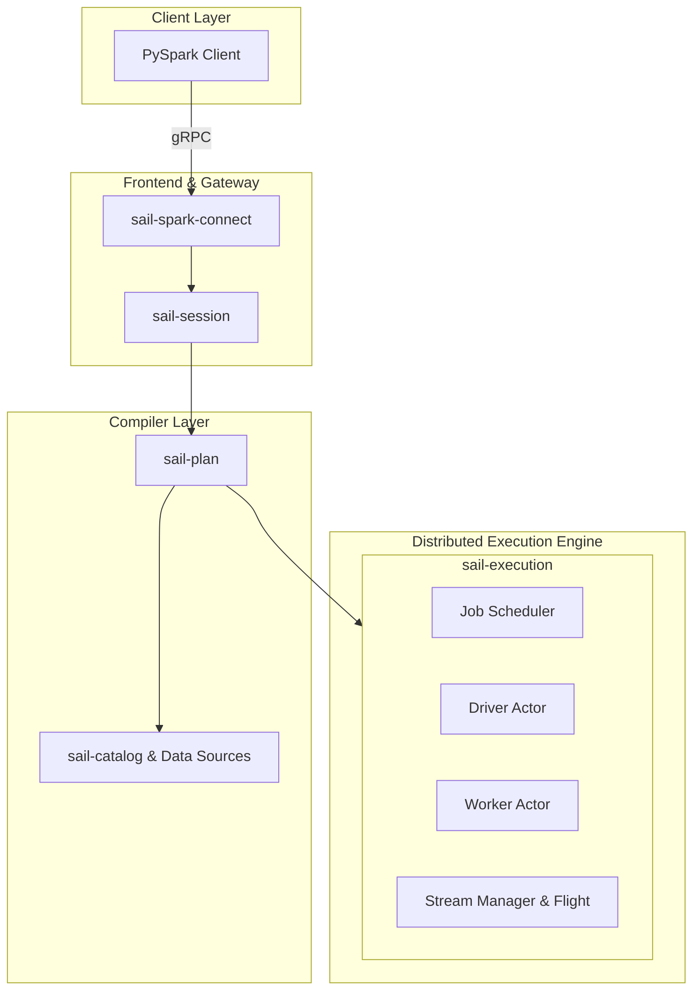
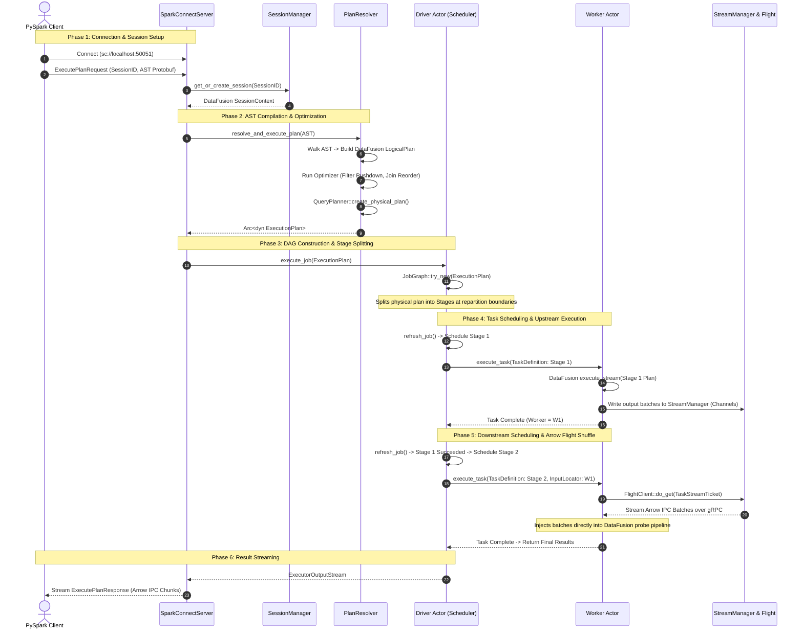
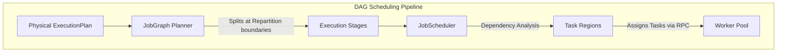
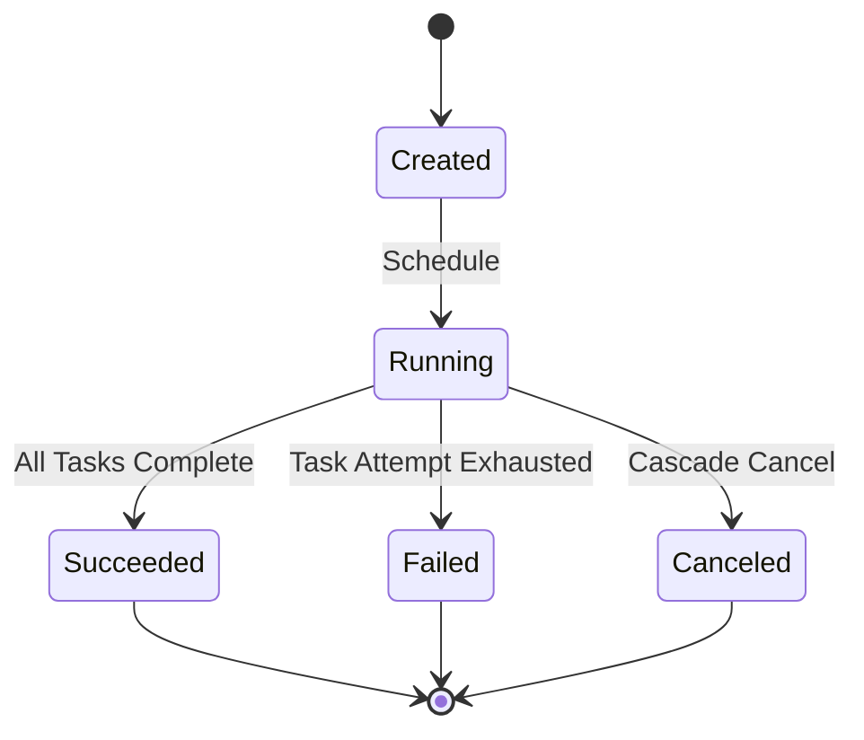
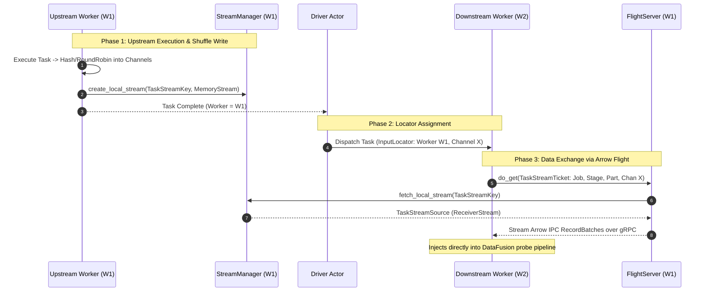
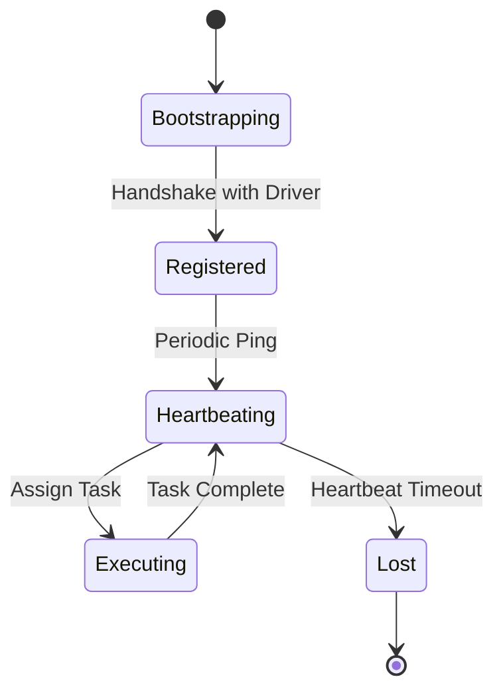

# Sail Architecture & Contributor Guide

Welcome to the definitive architectural reference and contributor guide for **Sail**. 

Whether you are a seasoned systems engineer or a newcomer to distributed data processing, this guide is designed to provide a self-contained, exhaustive deep dive into Sail's internal mechanics. It covers everything from fundamental concepts and codebase topology to query compilation lifecycles, distributed DAG scheduling, and high-speed Arrow Flight shuffle architecture.

---

## 1. Introduction & Core Philosophy

### 1.1 The Problem with Legacy Spark
For over 15 years, Apache Spark has been the industry standard for distributed data processing. However, its foundation on the Java Virtual Machine (JVM) introduces severe performance and operational bottlenecks:
*   **Garbage Collection (GC) Pauses**: Massive in-memory datasets cause unpredictable GC pauses, stalling execution pipelines.
*   **Heavy Memory Footprint**: Object serialization and JVM heap management inflate memory usage, requiring massive, expensive cloud instances.
*   **Slow Startup Times**: Bootstrapping a JVM cluster takes minutes, making it unsuitable for elastic, serverless, or interactive AI workloads.

### 1.2 The Sail Solution
Sail is a **100% Rust-native, drop-in replacement** for Apache Spark. It eliminates the JVM entirely while maintaining perfect behavioral parity with the Spark DataFrame and SQL APIs. 

By leveraging **Apache DataFusion** (a state-of-the-art vectorized query engine) and **Apache Arrow** (the industry standard columnar memory format), Sail delivers up to **4x faster execution** and **94% lower infrastructure costs**.

```mermaid
graph TD
    subgraph PySpark Client (No changes needed)
        PC[PySpark Code: df.filter(...).show()]
    end

    subgraph Sail Standalone Rust Engine (Zero JVM)
        SC[Spark Connect gRPC Gateway] --> AST[AST Compiler / PlanResolver]
        AST --> Opt[DataFusion Optimizer]
        Opt --> JS[Distributed DAG Scheduler]
        JS --> DF[DataFusion Physical Engine]
        DF -- "Arrow Flight Shuffle" --> DF
    end

    PC -- "sc://localhost:50051" --> SC
```

---

## 2. Codebase Topology & Component Deep Dive

The Sail monorepo is modularized into specialized crates. To understand Sail, you must understand the role and internal mechanics of each core component.



### 2.1 `sail-spark-connect` (The gRPC Gateway)
*   **Background**: In modern Spark architecture, the client (e.g., a Python script or Jupyter notebook) is decoupled from the execution engine via the **Spark Connect** gRPC protocol.
*   **Role**: `sail-spark-connect` implements the official Spark Connect protobuf service definitions (`execute_plan`, `analyze_plan`, `config`, `interrupt`). It acts as the front door to the Sail server.
*   **Internal Mechanics**: Built on top of Tokio and Tonic (Rust's premier gRPC framework), it accepts incoming client connections, extracts metadata (such as UUIDs, user tags, and session IDs), and routes incoming protobuf query ASTs to the underlying session manager. It wraps all execution results into asynchronous streaming responses (`ExecutePlanResponse`).

### 2.2 `sail-session` (The Multitenant Isolation Layer)
*   **Background**: Analytical engines must support multiple concurrent users and queries without cross-session interference.
*   **Role**: `sail-session` manages the lifecycle of user sessions (`SparkSession`). It mirrors DataFusion's `SessionContext` but adds robust multitenant management.
*   **Internal Mechanics**: 
    *   **Session Manager**: Maintains a thread-safe, LRU-backed registry of active sessions. If a client does not send requests within `session_timeout_secs` (default 15 minutes), the manager reaps the session, releasing associated memory and temporary files.
    *   **Extension Injection**: When a session is constructed via `ServerSessionFactory`, Sail injects custom extensions into the DataFusion `SessionConfig`, including `ActivityTracker` (for monitoring idle times), `PlanService` (for AST formatting), and `JobService` (attaching the execution runner).

### 2.3 `sail-plan` (The Compiler & AST Translator)
*   **Background**: PySpark clients transmit query plans as Spark Connect ASTs (`spec::Plan`). DataFusion, however, executes DataFusion `LogicalPlan` structures.
*   **Role**: `sail-plan` is the compiler layer that translates Spark ASTs into optimized DataFusion logical and physical plans.
*   **Internal Mechanics**: The core of this crate is the `PlanResolver` (`sail-plan/src/resolver/query/mod.rs`). It acts as a recursive descent compiler, walking the Spark AST nodes and performing complex semantic mappings:
    *   **Scan Resolution**: Translates Spark table scans (`ReadType::NamedTable`) into DataFusion `TableScan` logical nodes, resolving schemas against Sail's custom catalogs.
    *   **Relational Mapping**: Maps transformations (`Project`, `Filter`, `Join`, `Aggregate`) into DataFusion logical builders.
    *   **Expression Parsing**: Converts Spark SQL expressions, literals, and mathematical operators into DataFusion `Expr` structs, maintaining a tracking state (`PlanResolverState`) to manage complex column aliasing and hidden metadata fields.

### 2.4 `sail-execution` (The Distributed Engine)
*   **Background**: Apache DataFusion is primarily a single-node execution engine. `sail-execution` wraps DataFusion with a distributed cluster control plane.
*   **Role**: Houses the distributed DAG scheduler, actor systems, worker pools, and shuffle managers.
*   **Internal Mechanics**: Operates with a strict separation between the Control Plane (Tonic gRPC / Actor messaging) and Data Plane (Arrow Flight streams).

### 2.5 `sail-catalog` & `sail-data-source` (Enterprise Lakehouse Integration)
*   **Background**: DataFusion's default catalog is an in-memory structure. Modern enterprise lakehouses require integration with external metadata providers.
*   **Role**: Provides native support for Delta Lake, Apache Iceberg, Hive Metastore (HMS), AWS Glue, Unity Catalog, and Microsoft OneLake.
*   **Internal Mechanics**: Implements DataFusion's `CatalogProvider` and `SchemaProvider` traits. When a query references a table `my_catalog.default.sales`, Sail intercepts the resolution, queries the external metadata service (e.g., parsing Delta log transaction files or Iceberg REST manifests), and returns a fully configured physical table scan provider.

---

## 3. Execution Modes Matrix

Sail transitions seamlessly between local development and large-scale cluster execution via `AppConfig.mode`:

```rust
// From sail-common/src/config/application.rs
pub enum ExecutionMode {
    Local,
    LocalCluster,
    KubernetesCluster,
}
```

| Execution Mode | Architecture & Topology | Primary Use Case | Communication Protocol |
| :--- | :--- | :--- | :--- |
| **`Local`** | Single process, multithreaded. Uses `LocalJobRunner`. | Ad-hoc analytics, laptop development, unit testing. | In-process memory sharing (Zero RPC). |
| **`LocalCluster`** | Single process, multi-actor. Emulates driver and workers on local threads. | Debugging distributed scheduling, RPC logic, and shuffle graphs. | In-process local RPC channels. |
| **`KubernetesCluster`** | Distributed pods. Driver and workers run in separate Kubernetes containers. | Production lakehouse processing, heavy ETL, massive AI workloads. | Control: Tonic gRPC. Data: Arrow Flight. |

---

## 4. Comprehensive Query Lifecycle

To understand how all components unite, we trace the comprehensive lifecycle of a distributed PySpark DataFrame query.



---

## 5. Distributed Scheduler Engine (`JobScheduler`)

In cluster mode, the physical `ExecutionPlan` is managed by the `JobScheduler` (`sail-execution/src/driver/job_scheduler/core.rs`).



### 5.1 DAG Construction (`JobGraph`)
The `JobGraph` planner (`sail-execution/src/job_graph/planner.rs`) walks the physical execution plan tree. 

Whenever it encounters a data repartitioning boundary—specifically `RepartitionExec` or `CoalescePartitionsExec`—it severs the plan tree and inserts a **Stage Boundary**.

```rust
// From sail-execution/src/job_graph/planner.rs
fn build_job_graph(plan: Arc<dyn ExecutionPlan>, usage: PartitionUsage, graph: &mut JobGraph) -> ExecutionResult<Arc<dyn ExecutionPlan>> {
    if let Some(repartition) = plan.as_any().downcast_ref::<RepartitionExec>() {
        let child = plan.children().one()?;
        // Replace repartition node with StageInputExec (shuffle read placeholder)
        create_shuffle(child, graph, properties, consumption)?
    } else {
        // ... continue walking tree
    }
}
```

The severed upstream tree becomes a distinct `Stage`. The repartitioning node in the downstream stage is replaced by a `StageInputExec`—a custom physical plan node representing the receiving end of a distributed shuffle.

### 5.2 Task Region Topology
A `Stage` is subdivided into multiple `Task`s corresponding to its output partitions. The driver organizes these tasks into `TaskRegion`s (`TaskRegionTopology`).



#### Driver State Machines
The scheduler maintains explicit state tracking across four tiers:

1.  **`JobState`**: `Running`, `Draining` (all tasks complete, draining output buffer), `Succeeded`, `Failed`, `Canceled`.
2.  **`StageState`**: `Active`, `Inactive` (all downstream consumer stages have fully processed its shuffle output).
3.  **`TaskState`**: `Created`, `Running`, `Succeeded`, `Failed`, `Canceled`.
4.  **`TaskAttemptDescriptor`**: Tracks individual execution attempts, failure messages, and stop timestamps.

### 5.3 Driver Scheduling Loop (`refresh_job`)
The driver actor periodically evaluates the job state machine via `JobScheduler::refresh_job`:

```rust
// Core execution loop of JobScheduler
pub fn refresh_job(&mut self, job_id: JobId) -> Vec<JobAction> {
    let mut actions = vec![];
    
    // 1. Cascade cancel: If any task fails, cancel all active attempts in that TaskRegion
    actions.extend(Self::cascade_cancel_task_attempts(job_id, job));
    
    // 2. Output management: Attach completed final-stage partitions to job output streams
    actions.extend(Self::extend_job_output(job_id, job));
    
    // 3. Cleanup: If a stage's consumers have all succeeded, drop its shuffle data
    actions.extend(Self::clean_up_job_by_stage(job_id, job));
    
    // 4. State evaluation
    Self::update_task_regions(job, &self.options);
    if job.regions.iter().any(|x| matches!(x.state, TaskRegionState::Failed)) {
        job.state = JobState::Failed;
        return actions;
    }
    
    // 5. Schedule unblocked regions
    actions.extend(Self::schedule_task_regions(job_id, job));
    actions
}
```

### 5.4 Task Assignment & Dispatch
When `schedule_task_regions` identifies a ready task region (all upstream dependency regions are `Succeeded`), it generates a `TaskDefinition`.

```rust
pub struct TaskDefinition {
    pub plan: Arc<[u8]>, // Serialized DataFusion PhysicalPlanNode protobuf
    pub inputs: Vec<TaskInput>, // Upstream Worker Locators
    pub output: TaskOutput, // Output distribution (Hash vs RoundRobin)
}
```

The driver selects an available worker from the `WorkerPool` (matching slot availability) and transmits the `TaskDefinition` over Tonic gRPC (`DriverToWorker::execute_task`).

### 5.5 Failure Recovery & Retries
If a worker pod crashes or a network timeout occurs, the worker actor reports a task failure. 
The scheduler inspects the failure cause. If the number of attempts (`attempts.len()`) is less than `config.cluster.task_max_attempts`, the scheduler instantiates a new `TaskAttemptDescriptor`, selects a different worker node, and re-dispatches the task.

---

## 6. Distributed Shuffle Architecture (Arrow Flight)

Sail completely replaces DataFusion's single-node in-memory repartitioning queues with a high-speed, distributed shuffle architecture powered by **Apache Arrow Flight**.



### 6.1 Upstream Execution & Shuffle Write
When an upstream task executes on a worker node, its final physical plan node is wrapped by a shuffle writer (`TaskStreamSink`). 

As DataFusion record batches flow through the pipeline, the shuffle writer partitions the data into distinct **Channels** (corresponding to downstream task partitions) using either hashing (`OutputDistribution::Hash`) or round-robin batches (`OutputDistribution::RoundRobin`).

The worker stores these partitioned batches inside its local `StreamManager` (`sail-execution/src/stream_manager/core.rs`):

```rust
// From sail-execution/src/stream_manager/core.rs
pub enum LocalStreamStorage {
    Memory { replicas: usize },
    Disk, // On-disk spilling support
}

pub enum LocalStreamState {
    Pending { senders: Vec<mpsc::Sender<TaskStreamResult<RecordBatch>>> },
    Created { stream: Box<dyn LocalStream> },
    Failed { cause: CommonErrorCause },
}
```
Currently, Sail holds shuffle data in high-speed memory (`MemoryStream`), avoiding the heavy disk I/O bottlenecks that characterize traditional Spark shuffle managers.

### 6.2 Task Locators & Coordination
When the upstream task finishes, the worker notifies the driver. The driver records the exact `worker_id` and gRPC URI where the partition was executed.

When scheduling downstream tasks, the `JobScheduler` constructs a `TaskInputLocator` for each required shuffle channel:

```rust
// From sail-execution/src/task/definition.rs
pub enum TaskInputLocator {
    Worker {
        stage: usize,
        keys: Vec<Vec<(u64, TaskInputKey)>>, // Outer: Channels, Inner: (WorkerID, Key)
    },
    Driver { stage: usize, keys: Vec<Vec<TaskInputKey>> },
}
```

### 6.3 Arrow Flight Exchange Protocol
When the downstream worker receives its `TaskDefinition`, it inspects the `TaskInputLocator::Worker`. For each upstream worker ID, it instantiates a `TaskStreamFlightClient` (`sail-execution/src/stream_service/client.rs`).

It initiates an Arrow Flight `do_get` request, passing an encoded `TaskStreamTicket`:

```rust
// From sail-execution/src/stream/gen.rs
pub struct TaskStreamTicket {
    pub job_id: u64,
    pub stage: u64,
    pub partition: u64,
    pub attempt: u64,
    pub channel: u64,
}
```

### 6.4 Flight Server Materialization
The upstream worker's `TaskStreamFlightServer` (`sail-execution/src/stream_service/server.rs`) intercepts the `do_get` request:

1.  Decodes the `TaskStreamTicket`.
2.  Constructs a `TaskStreamKey`.
3.  Calls `StreamManager::fetch_local_stream(&key)`.
4.  Wraps the returned asynchronous record batch stream inside an `arrow_flight::FlightDataEncoderBuilder`.
5.  Streams the Arrow IPC bytes over the gRPC socket back to the downstream worker.

The downstream worker receives these IPC batches and injects them instantly into its local DataFusion execution pipeline (e.g., as the probe side of a distributed Hash Join).

---

## 7. Worker Node Lifecycle & Concurrency

In cluster mode, worker nodes operate as independent actor systems managed by a `WorkerManager` (`LocalWorkerManager` or `KubernetesWorkerManager`).



### 7.1 Bootstrapping & Handshake
1.  **Provisioning**: The driver actor requests worker slots from the `WorkerManager`. In Kubernetes mode, this spawns a new pod using the configured `worker_pod_template`.
2.  **Handshake**: The worker process boots, binds its internal gRPC and Arrow Flight servers, and sends a `RegisterWorker` RPC to the driver's listening address.
3.  **Pool Enrollment**: The driver enrolls the worker in its `WorkerPool`, tracking its available task slots (`config.cluster.worker_task_slots`).

### 7.2 Heartbeat & Health Monitoring
Workers maintain active health checks with the driver:
*   **Worker to Driver**: Sends periodic heartbeats (`config.cluster.worker_heartbeat_interval_secs`).
*   **Driver Monitoring**: If the driver fails to receive a heartbeat within `worker_heartbeat_timeout_secs`, it transitions the worker state to `Lost`.
*   **Recovery**: The driver unassigns all active tasks belonging to the lost worker, marks those task attempts as `Failed(WorkerLost)`, and triggers `JobScheduler::refresh_job` to re-schedule the affected task regions on healthy workers.

---

## 8. Contributor Reference & Navigation Guide

To assist contributors in navigating the monorepo, here is a mapping of core architectural subsystems to their exact source files:

| Subsystem / Component | Crate | Core Source File Path |
| :--- | :--- | :--- |
| **App Configuration Hierarchy** | `sail-common` | `src/config/application.rs` |
| **Spark Connect gRPC Server** | `sail-spark-connect` | `src/server.rs` |
| **DataFrame AST Translation** | `sail-plan` | `src/resolver/query/mod.rs` |
| **Session & Catalog Management** | `sail-session` | `src/session_factory/server.rs` |
| **Local Execution Runner** | `sail-execution` | `src/job_runner.rs` |
| **JobGraph (DAG) Planner** | `sail-execution` | `src/job_graph/planner.rs` |
| **Distributed Job Scheduler** | `sail-execution` | `src/driver/job_scheduler/core.rs` |
| **Driver Actor System** | `sail-execution` | `src/driver/actor/core.rs` |
| **Worker Actor System** | `sail-execution` | `src/worker/actor/core.rs` |
| **Shuffle Stream Manager** | `sail-execution` | `src/stream_manager/core.rs` |
| **Arrow Flight Shuffle Server** | `sail-execution` | `src/stream_service/server.rs` |
| **Arrow Flight Shuffle Client** | `sail-execution` | `src/stream_service/client.rs` |
| **Kubernetes Pod Provisioning** | `sail-execution` | `src/worker_manager/kubernetes.rs` |
