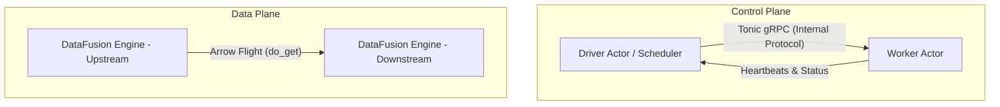
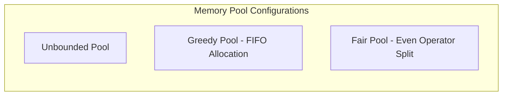
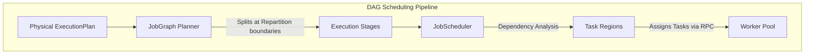
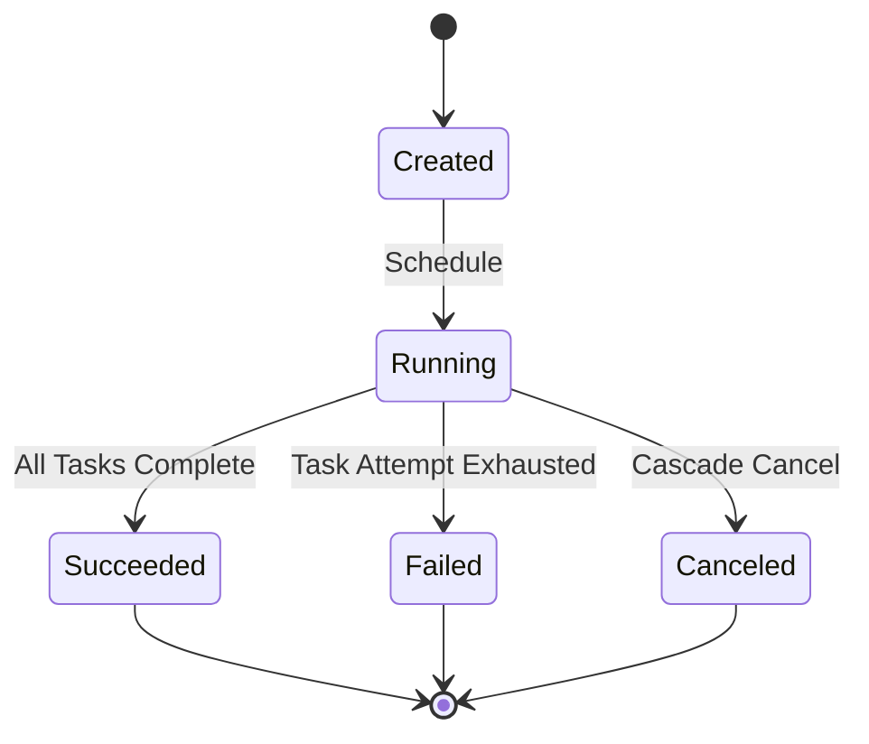
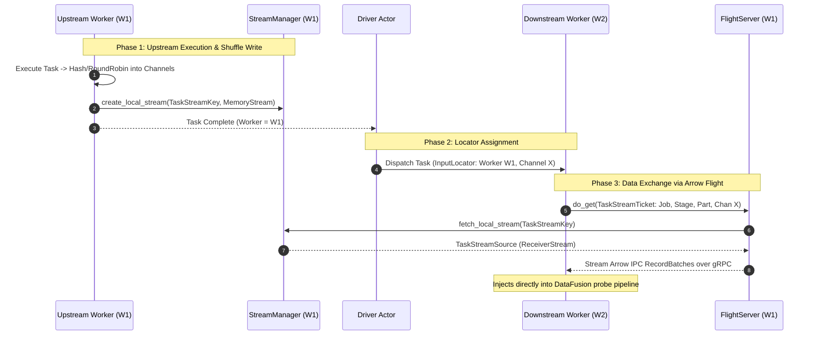
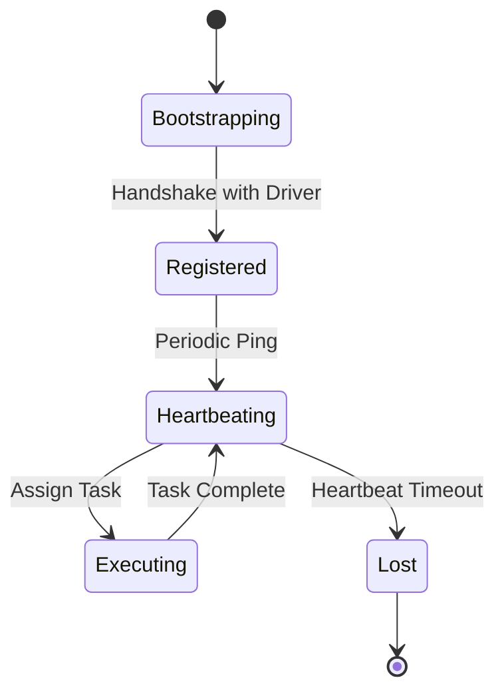

# Sail Architecture & Contributor Guide

Welcome to the definitive architectural reference and contributor guide for **Sail**. 

Sail is a high-performance, drop-in replacement for Apache Spark written entirely in Rust. It is built on top of **Apache DataFusion** and **Apache Arrow**, unifying batch processing, stream processing, and compute-intensive AI workloads without the overhead of the JVM.

This document provides an exhaustive, production-grade deep dive into Sail's internal codebase topology, query compilation lifecycle, distributed DAG scheduling mechanics, and high-speed Arrow Flight shuffle architecture. It is designed to onboard core contributors to the system’s most complex subsystems.

---

## 1. Architectural Foundations & Codebase Topology

Sail operates under a strict separation of concerns between the **Control Plane** (cluster coordination, task scheduling, metadata management) and the **Data Plane** (query execution, columnar data transformations, shuffle exchanges).



### 1.1 Module Hierarchy
The Sail monorepo is organized into specialized crates, each encapsulating a distinct layer of the execution stack:

*   **`sail-spark-connect`**: Implements the official Spark Connect gRPC protocol (`sc://...`). It accepts incoming client connections, decodes raw protobuf query plans, and manages streaming response channels.
*   **`sail-session`**: Governs user sessions (`SparkSession`). It manages session-level configuration isolation, temporary views, UDF registries, and custom catalog mounts.
*   **`sail-plan`**: The query compiler. It translates Spark Connect ASTs (`spec::Plan`) into DataFusion `LogicalPlan` structures, applies custom analyzer/optimizer rules, and generates physical `ExecutionPlan` graphs.
*   **`sail-execution`**: The core distributed execution engine. It houses the `JobScheduler`, `DriverActor`, `WorkerActor`, `WorkerPool`, `StreamManager`, and Arrow Flight shuffle services.
*   **`sail-common-datafusion`**: Extension traits and utilities wrapping DataFusion core data structures (e.g., memory pools, execution configurations, system tables).
*   **`sail-catalog` / `sail-data-source`**: Custom lakehouse integration crates providing native support for Delta Lake, Apache Iceberg, Hive Metastore, AWS Glue, Unity Catalog, and Microsoft OneLake without relying on DataFusion's default memory catalogs.

### 1.2 Execution Modes
Sail supports three primary execution topologies configured via `AppConfig.mode`:

```rust
// From sail-common/src/config/application.rs
pub enum ExecutionMode {
    Local,
    LocalCluster,
    KubernetesCluster,
}
```

1.  **`Local` Mode**: Executes physical plans directly within the server process using DataFusion's multithreaded execution model. There is no actor-based RPC communication or network serialization overhead.
2.  **`LocalCluster` Mode**: Emulates a distributed cluster within a single OS process. It spawns distinct driver and worker actor systems across different CPU threads that communicate over local RPC channels, validating distributed scheduling logic.
3.  **`KubernetesCluster` Mode**: Production distributed deployment. The driver and workers run in separate Kubernetes pods. Sail dynamically provisions worker pods via the Kubernetes API and coordinates tasks over Tonic gRPC.

### 1.3 Memory Management Architecture
To prevent Out-Of-Memory (OOM) crashes during intensive distributed joins and aggregations, Sail tightly controls memory allocation via DataFusion's `MemoryPool` abstractions:



*   **`Unbounded`**: Allocates memory freely without limits (ideal for isolated or over-provisioned environments).
*   **`Greedy`**: Allocates memory up to a maximum limit (`max_size`) on a first-come, first-served basis.
*   **`Fair`**: Allocates memory up to a limit while ensuring that a single rogue operator does not starve concurrent execution nodes.

---

## 2. Query Compilation & AST Translation

When a PySpark client triggers an action (e.g., `.show()`), it transmits an `ExecutePlanRequest` protobuf message. Sail compiles this request into an executable DataFusion physical plan through a multi-phase pipeline.

```mermaid
sequenceDiagram
    autonumber
    participant SC as SparkConnectServer
    participant PR as PlanResolver
    participant Opt as DataFusion Optimizer
    participant QP as QueryPlanner

    SC->>PR: resolve_and_execute_plan(spec::Plan)
    Note over PR: Recursively walks Spark AST
    PR->>PR: Map Scans, Projections, Joins -> LogicalPlan
    PR->>PR: Resolve PyO3 UDFs & Expressions
    PR->>Opt: Optimize LogicalPlan (Default + Sail Rules)
    Opt->>QP: create_physical_plan()
    QP-->>SC: Arc<dyn ExecutionPlan>
```

### 2.1 Request Interception (`SparkConnectServer`)
In `server.rs`, incoming requests are routed based on their root plan type:

*   **Commands** (`CommandPlan`): DDL statements, table creation, writing data, UDF registration. These execute eagerly and return empty success streams or scalar summaries.
*   **Relations** (`RelationPlan`): Standard DataFrame transformations (`Filter`, `Join`, `Aggregate`). These execute lazily, building an execution pipeline that streams Arrow batches back to the client.

### 2.2 AST Resolution (`PlanResolver`)
The `PlanResolver` (`sail-plan/src/resolver/query/mod.rs`) recursively traverses Spark AST nodes (`spec::QueryNode`) and maps them into DataFusion `LogicalPlan` nodes.

```rust
// Conceptual architecture of PlanResolver
impl PlanResolver<'_> {
    pub async fn resolve_query_plan(&self, plan: spec::QueryPlan, state: &mut PlanResolverState) -> PlanResult<LogicalPlan> {
        match plan.node {
            QueryNode::Read { read_type, .. } => self.resolve_read(read_type, state).await,
            QueryNode::Project { input, expressions } => self.resolve_project(input, expressions, state).await,
            QueryNode::Filter { input, condition } => self.resolve_filter(input, condition, state).await,
            QueryNode::Join(join) => self.resolve_join(join, state).await,
            QueryNode::Aggregate(agg) => self.resolve_aggregate(agg, state).await,
            // ... 30+ other node types
        }
    }
}
```

#### State Tracking (`PlanResolverState`)
Spark Connect ASTs rely heavily on complex column aliasing, subquery scoping, and implicit metadata fields. `PlanResolverState` maintains a registry mapping unresolved spec field names to fully qualified DataFusion `Column` structures.

#### Python UDF Integration
When resolving Python User-Defined Functions (UDFs) or Data Sources, Sail embeds Python runtimes (`PyO3`). Because both Sail and Python (via PyArrow/Pandas) operate on Apache Arrow memory buffers, data is shared between the Rust engine and Python workers using **zero-copy Arrow array pointers**, completely bypassing serialization bottlenecks.

### 2.3 Logical Optimization & Physical Planning
Once the DataFusion `LogicalPlan` is built:
1.  **Analyzer Rules**: Evaluates type coercions, function signatures, and semantic validity.
2.  **Optimizer Rules**: Pushes filters down into table scans, eliminates redundant projections, reorders joins based on table statistics, and coerces view types (`Utf8View`) to standard types at output boundaries.
3.  **Physical Planning**: Invokes DataFusion's `QueryPlanner` (`session_state.create_physical_plan()`). This converts logical nodes into physical execution nodes (e.g., converting a logical join into a physical `HashJoinExec` or `SortMergeJoinExec`).

---

## 3. Distributed Scheduler Engine (`JobScheduler`)

In cluster mode (`LocalCluster` or `KubernetesCluster`), the physical `ExecutionPlan` cannot be executed directly by a single node. It must be managed by the `JobScheduler` (`sail-execution/src/driver/job_scheduler/core.rs`).



### 3.1 DAG Construction (`JobGraph`)
The `JobGraph` planner (`sail-execution/src/job_graph/planner.rs`) walks the physical execution plan tree. 

Whenever it encounters a data repartitioning boundary—specifically `RepartitionExec` or `CoalescePartitionsExec`—it severs the plan tree and inserts a **Stage Boundary**.

```rust
// From sail-execution/src/job_graph/planner.rs
fn build_job_graph(plan: Arc<dyn ExecutionPlan>, usage: PartitionUsage, graph: &mut JobGraph) -> ExecutionResult<Arc<dyn ExecutionPlan>> {
    if let Some(repartition) = plan.as_any().downcast_ref::<RepartitionExec>() {
        let child = plan.children().one()?;
        // Replace repartition node with StageInputExec (shuffle read placeholder)
        create_shuffle(child, graph, properties, consumption)?
    } else {
        // ... continue walking tree
    }
}
```

The severed upstream tree becomes a distinct `Stage`. The repartitioning node in the downstream stage is replaced by a `StageInputExec`—a custom physical plan node representing the receiving end of a distributed shuffle.

### 3.2 Task Region Topology
A `Stage` is subdivided into multiple `Task`s corresponding to its output partitions. The driver organizes these tasks into `TaskRegion`s (`TaskRegionTopology`).



#### Driver State Machines
The scheduler maintains explicit state tracking across four tiers:

1.  **`JobState`**: `Running`, `Draining` (all tasks complete, draining output buffer), `Succeeded`, `Failed`, `Canceled`.
2.  **`StageState`**: `Active`, `Inactive` (all downstream consumer stages have fully processed its shuffle output).
3.  **`TaskState`**: `Created`, `Running`, `Succeeded`, `Failed`, `Canceled`.
4.  **`TaskAttemptDescriptor`**: Tracks individual execution attempts, failure messages, and stop timestamps.

### 3.3 Driver Scheduling Loop (`refresh_job`)
The driver actor periodically evaluates the job state machine via `JobScheduler::refresh_job`:

```rust
// Core execution loop of JobScheduler
pub fn refresh_job(&mut self, job_id: JobId) -> Vec<JobAction> {
    let mut actions = vec![];
    
    // 1. Cascade cancel: If any task fails, cancel all active attempts in that TaskRegion
    actions.extend(Self::cascade_cancel_task_attempts(job_id, job));
    
    // 2. Output management: Attach completed final-stage partitions to job output streams
    actions.extend(Self::extend_job_output(job_id, job));
    
    // 3. Cleanup: If a stage's consumers have all succeeded, drop its shuffle data
    actions.extend(Self::clean_up_job_by_stage(job_id, job));
    
    // 4. State evaluation
    Self::update_task_regions(job, &self.options);
    if job.regions.iter().any(|x| matches!(x.state, TaskRegionState::Failed)) {
        job.state = JobState::Failed;
        return actions;
    }
    
    // 5. Schedule unblocked regions
    actions.extend(Self::schedule_task_regions(job_id, job));
    actions
}
```

### 3.4 Task Assignment & Dispatch
When `schedule_task_regions` identifies a ready task region (all upstream dependency regions are `Succeeded`), it generates a `TaskDefinition`.

```rust
pub struct TaskDefinition {
    pub plan: Arc<[u8]>, // Serialized DataFusion PhysicalPlanNode protobuf
    pub inputs: Vec<TaskInput>, // Upstream Worker Locators
    pub output: TaskOutput, // Output distribution (Hash vs RoundRobin)
}
```

The driver selects an available worker from the `WorkerPool` (matching slot availability) and transmits the `TaskDefinition` over Tonic gRPC (`DriverToWorker::execute_task`).

### 3.5 Failure Recovery & Retries
If a worker pod crashes or a network timeout occurs, the worker actor reports a task failure. 
The scheduler inspects the failure cause. If the number of attempts (`attempts.len()`) is less than `config.cluster.task_max_attempts`, the scheduler instantiates a new `TaskAttemptDescriptor`, selects a different worker node, and re-dispatches the task.

---

## 4. Distributed Shuffle Architecture (Arrow Flight)

Sail completely replaces DataFusion's single-node in-memory repartitioning queues with a high-speed, distributed shuffle architecture powered by **Apache Arrow Flight**.



### 4.1 Upstream Execution & Shuffle Write
When an upstream task executes on a worker node, its final physical plan node is wrapped by a shuffle writer (`TaskStreamSink`). 

As DataFusion record batches flow through the pipeline, the shuffle writer partitions the data into distinct **Channels** (corresponding to downstream task partitions) using either hashing (`OutputDistribution::Hash`) or round-robin batches (`OutputDistribution::RoundRobin`).

The worker stores these partitioned batches inside its local `StreamManager` (`sail-execution/src/stream_manager/core.rs`):

```rust
// From sail-execution/src/stream_manager/core.rs
pub enum LocalStreamStorage {
    Memory { replicas: usize },
    Disk, // On-disk spilling support
}

pub enum LocalStreamState {
    Pending { senders: Vec<mpsc::Sender<TaskStreamResult<RecordBatch>>> },
    Created { stream: Box<dyn LocalStream> },
    Failed { cause: CommonErrorCause },
}
```
Currently, Sail holds shuffle data in high-speed memory (`MemoryStream`), avoiding the heavy disk I/O bottlenecks that characterize traditional Spark shuffle managers.

### 4.2 Task Locators & Coordination
When the upstream task finishes, the worker notifies the driver. The driver records the exact `worker_id` and gRPC URI where the partition was executed.

When scheduling downstream tasks, the `JobScheduler` constructs a `TaskInputLocator` for each required shuffle channel:

```rust
// From sail-execution/src/task/definition.rs
pub enum TaskInputLocator {
    Worker {
        stage: usize,
        keys: Vec<Vec<(u64, TaskInputKey)>>, // Outer: Channels, Inner: (WorkerID, Key)
    },
    Driver { stage: usize, keys: Vec<Vec<TaskInputKey>> },
}
```

### 4.3 Arrow Flight Exchange Protocol
When the downstream worker receives its `TaskDefinition`, it inspects the `TaskInputLocator::Worker`. For each upstream worker ID, it instantiates a `TaskStreamFlightClient` (`sail-execution/src/stream_service/client.rs`).

It initiates an Arrow Flight `do_get` request, passing an encoded `TaskStreamTicket`:

```rust
// From sail-execution/src/stream/gen.rs
pub struct TaskStreamTicket {
    pub job_id: u64,
    pub stage: u64,
    pub partition: u64,
    pub attempt: u64,
    pub channel: u64,
}
```

### 4.4 Flight Server Materialization
The upstream worker's `TaskStreamFlightServer` (`sail-execution/src/stream_service/server.rs`) intercepts the `do_get` request:

1.  Decodes the `TaskStreamTicket`.
2.  Constructs a `TaskStreamKey`.
3.  Calls `StreamManager::fetch_local_stream(&key)`.
4.  Wraps the returned asynchronous record batch stream inside an `arrow_flight::FlightDataEncoderBuilder`.
5.  Streams the Arrow IPC bytes over the gRPC socket back to the downstream worker.

The downstream worker receives these IPC batches and injects them instantly into its local DataFusion execution pipeline (e.g., as the probe side of a distributed Hash Join).

---

## 5. Worker Node Lifecycle & Concurrency

In cluster mode, worker nodes operate as independent actor systems managed by a `WorkerManager` (`LocalWorkerManager` or `KubernetesWorkerManager`).



### 5.1 Bootstrapping & Handshake
1.  **Provisioning**: The driver actor requests worker slots from the `WorkerManager`. In Kubernetes mode, this spawns a new pod using the configured `worker_pod_template`.
2.  **Handshake**: The worker process boots, binds its internal gRPC and Arrow Flight servers, and sends a `RegisterWorker` RPC to the driver's listening address.
3.  **Pool Enrollment**: The driver enrolls the worker in its `WorkerPool`, tracking its available task slots (`config.cluster.worker_task_slots`).

### 5.2 Heartbeat & Health Monitoring
Workers maintain active health checks with the driver:
*   **Worker to Driver**: Sends periodic heartbeats (`config.cluster.worker_heartbeat_interval_secs`).
*   **Driver Monitoring**: If the driver fails to receive a heartbeat within `worker_heartbeat_timeout_secs`, it transitions the worker state to `Lost`.
*   **Recovery**: The driver unassigns all active tasks belonging to the lost worker, marks those task attempts as `Failed(WorkerLost)`, and triggers `JobScheduler::refresh_job` to re-schedule the affected task regions on healthy workers.

---

## 6. Contributor Reference & Navigation Guide

To assist contributors in navigating the monorepo, here is a mapping of core architectural subsystems to their exact source files:

| Subsystem / Component | Crate | Core Source File Path |
| :--- | :--- | :--- |
| **App Configuration Hierarchy** | `sail-common` | `src/config/application.rs` |
| **Spark Connect gRPC Server** | `sail-spark-connect` | `src/server.rs` |
| **DataFrame AST Translation** | `sail-plan` | `src/resolver/query/mod.rs` |
| **Session & Catalog Management** | `sail-session` | `src/session_factory/server.rs` |
| **Local Execution Runner** | `sail-execution` | `src/job_runner.rs` |
| **JobGraph (DAG) Planner** | `sail-execution` | `src/job_graph/planner.rs` |
| **Distributed Job Scheduler** | `sail-execution` | `src/driver/job_scheduler/core.rs` |
| **Driver Actor System** | `sail-execution` | `src/driver/actor/core.rs` |
| **Worker Actor System** | `sail-execution` | `src/worker/actor/core.rs` |
| **Shuffle Stream Manager** | `sail-execution` | `src/stream_manager/core.rs` |
| **Arrow Flight Shuffle Server** | `sail-execution` | `src/stream_service/server.rs` |
| **Arrow Flight Shuffle Client** | `sail-execution` | `src/stream_service/client.rs` |
| **Kubernetes Pod Provisioning** | `sail-execution` | `src/worker_manager/kubernetes.rs` |
