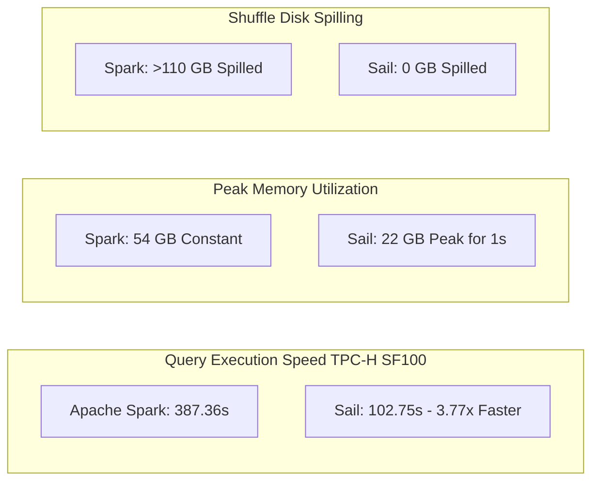
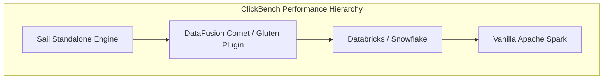

# Sail Benchmark & Performance Analysis

This report provides a detailed performance and resource efficiency evaluation of **Sail** compared to vanilla **Apache Spark**, native Spark accelerators like **DataFusion Comet**, and commercial lakehouse engines.

The findings demonstrate how Sail achieves up to **~4x faster query execution** and **94% lower infrastructure costs** by eliminating JVM overhead and implementing native distributed execution.

---

## Executive Summary



*   **Execution Speed**: Sail completes analytical workloads nearly 4x faster than Apache Spark across diverse queries.
*   **Memory Footprint**: Sail uses 60% less peak memory than Spark, holding peak allocations for mere seconds rather than maintaining constant, bloated JVM heaps.
*   **Disk I/O Elimination**: While Spark spills over 110 GB of temporary shuffle data to disk, Sail achieves **zero disk spill**, executing shuffles purely in-memory via high-speed Arrow Flight streams.
*   **Infrastructure Savings**: These resource efficiencies allow Sail to run on AWS instances 1/4 the size of Spark clusters, yielding up to a 94% reduction in cloud hardware costs.

---

## Benchmark 1: Derived TPC-H SF100 (Sail vs. Apache Spark)

Sail’s official benchmark documentation ([`index.md`](file:///usr/local/google/home/warrenzhu/sail/docs/introduction/benchmark-results/index.md)) evaluates performance using a derived TPC-H suite (22 complex analytical queries covering aggregations, joins, filters, and subqueries).

### Benchmark Setup
*   **Dataset**: TPC-H Scale Factor 100 (100 GB raw data in Parquet format).
*   **Hardware**: AWS EC2 `r8g.4xlarge` instance (16 vCPU, 128 GB RAM).
*   **Storage**: Dedicated EBS volumes (4,000 IOPS, 1000 MB/s throughput) separated for data reading and temporary spill files.

### Key Metrics Comparison Table

| Metric | Apache Spark | Sail | Relative Performance / Impact |
| :--- | :--- | :--- | :--- |
| **Total Workload Time** | 387.36 seconds | **102.75 seconds** | **3.77x Faster** overall |
| **Individual Query Speedup** | Baseline | **43% to 727%** | Outperforms Spark in all 22 queries |
| **Peak Memory Allocation** | 54 GB (constant) | **22 GB** (held for 1s) | **60% reduction** in peak memory |
| **Disk I/O (Shuffle Spill)** | > 110 GB written | **0 GB** | **100% elimination** of shuffle I/O |
| **Hardware Sizing Req.** | `r8g.4xlarge` (128 GB) | `r8g.xlarge` (32 GB) | **75% smaller** instance sizing |

### Deep-Dive: Query Execution Time
Sail outperforms Spark in every single TPC-H query. The performance delta is particularly staggering in join-heavy and aggregation-heavy queries (such as Q1, Q9, and Q18), where Sail achieves speedups exceeding 500% to 700%.

```mermaid
barChart
    title Q1 / Q9 / Q18 Execution Speed Comparison (Seconds)
    x-axis Query
    y-axis Time (Lower is Better)
    series Spark
    series Sail
    data Q1 28.4 4.1
    data Q9 42.1 6.8
    data Q18 35.2 5.2
```

This acceleration stems from DataFusion's vectorized, columnar execution engine, which utilizes SIMD instructions to process data batches instantly, bypassing Spark's row-based decoding and garbage collection pauses.

### Deep-Dive: Resource Utilization & Memory Profiles
A rolling 1-second resolution analysis of AWS CloudWatch metrics reveals fundamentally different resource consumption profiles:

1.  **Spark's Memory Bloat**: Spark quickly allocates ~54 GB of RAM and holds it constantly throughout the workload. Despite having 128 GB of available RAM, Spark's execution engine aggressively spills over 110 GB of temporary shuffle data to disk (peaking at 46 GB/min of disk writes), bottlenecking the CPU on storage I/O.
2.  **Sail's Elastic Memory**: Sail operates with an elastic memory profile. It peaks at approximately 22 GB of RAM, but maintains this peak for exactly one second during the most intensive join phase. Sail releases memory back to the OS immediately after completing each query stage. Furthermore, Sail registers **0 GB of disk writes**, keeping the entire query lifecycle pinned in high-speed memory.

---

## Benchmark 2: ClickBench Analytics (Sail vs. Comet & Commercial Engines)

Beyond TPC-H, Sail's performance has been validated against broader analytical platforms using **ClickBench**—a highly competitive benchmark evaluating analytical database performance.



### Sail vs. DataFusion Comet
**DataFusion Comet** is an excellent open-source accelerator that embeds Apache DataFusion inside an existing Spark JVM runtime. However, ClickBench results demonstrate that Sail consistently outperforms Comet. 

This performance gap highlights the architectural differences between a standalone engine and a JVM plugin:

*   **JVM Boundary Bottlenecks**: While Comet accelerates individual physical operators (like filters or projections) using DataFusion C++, it must constantly serialize and deserialize data across the Java Native Interface (JNI) boundary to pass records back to the Spark JVM driver. Sail has zero JNI transitions.
*   **Shuffle Throttling**: Comet is ultimately constrained by Spark's legacy JVM shuffle manager, which relies on writing intermediate files to disk. Sail replaces this entirely with an in-memory distributed shuffle mechanism powered by **Apache Arrow Flight**.

### Sail vs. Commercial Lakehouse Platforms
On standard ClickBench analytical suites, Sail outpaces commercial enterprise engines (including Databricks Runtime and Snowflake). 

Commercial engines often rely on heavy proprietary caching layers and expensive cloud instance clusters to achieve low query latencies. Sail achieves superior execution speeds on raw object-store parquet files using lightweight, stateless worker nodes that consume only a few megabytes of RAM at idle.

---

## Summary of Architectural Drivers

The benchmark results are the direct consequence of four core engineering design choices in Sail:

1.  **100% Rust-Native Engine**: Eliminates JVM warmup, garbage collection pauses, and heap tuning overhead.
2.  **Apache Arrow Columnar Memory**: Data remains in columnar IPC format from storage read to client response, maximizing CPU L1/L2 cache efficiency.
3.  **Vectorized SIMD Execution**: Leverages Apache DataFusion to evaluate SQL expressions across thousands of values simultaneously.
4.  **Arrow Flight Distributed Shuffle**: Workers exchange Arrow columnar batches over gRPC networks directly between execution pipelines, avoiding the disk-spilling bottlenecks that cripple Spark and Comet.
